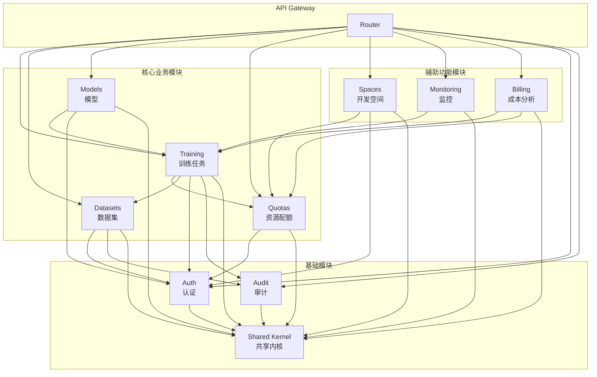

# AI 训练平台功能模块架构设计

**文档版本**: 1.0
**创建日期**: 2026-01-15
**架构模式**: Modular Monolith
**关联规范**: specs/001-ai-training-platform/spec.md

---

## 目录

1. [架构概述](#1-架构概述)
2. [设计原则](#2-设计原则)
3. [功能模块识别](#3-功能模块识别)
4. [后端模块结构](#4-后端模块结构)
5. [前端模块结构](#5-前端模块结构)
6. [模块依赖关系](#6-模块依赖关系)
7. [模块间通信规范](#7-模块间通信规范)
8. [共享内核设计](#8-共享内核设计)
9. [迁移策略](#9-迁移策略)
10. [架构决策记录](#10-架构决策记录)
11. [最佳实践](#11-最佳实践)

---

## 1. 架构概述

### 1.1 架构选型: Modular Monolith

本项目采用 **Modular Monolith** 架构模式，结合 **Clean Architecture** 和 **DDD (领域驱动设计)** 原则。

```
┌─────────────────────────────────────────────────────────────────┐
│                     Modular Monolith                             │
│  ┌──────────────────────────────────────────────────────────┐   │
│  │                    API Gateway Layer                      │   │
│  │              (路由聚合 + 认证 + 审计)                      │   │
│  └──────────────────────────────────────────────────────────┘   │
│       │         │         │         │         │         │       │
│  ┌────▼───┐┌────▼───┐┌────▼───┐┌────▼───┐┌────▼───┐┌────▼───┐  │
│  │Training││Datasets││ Models ││ Quotas ││ Spaces ││  ...   │  │
│  │ Module ││ Module ││ Module ││ Module ││ Module ││ Module │  │
│  └────────┘└────────┘└────────┘└────────┘└────────┘└────────┘  │
│       │         │         │         │         │         │       │
│  ┌──────────────────────────────────────────────────────────┐   │
│  │                    Shared Kernel                          │   │
│  │        (共享域对象 + 基础设施 + 工具)                       │   │
│  └──────────────────────────────────────────────────────────┘   │
│                              │                                   │
│  ┌──────────────────────────────────────────────────────────┐   │
│  │                    Infrastructure                         │   │
│  │     (Database + Cache + Message Queue + External APIs)    │   │
│  └──────────────────────────────────────────────────────────┘   │
└─────────────────────────────────────────────────────────────────┘
```

### 1.2 为什么选择 Modular Monolith

| 决策因素 | 当前项目情况 | 架构选择 |
|---------|-------------|---------|
| 团队规模 | 中小团队 (<30人) | ✅ Modular Monolith |
| 部署复杂度 | 追求简单运维 | ✅ Modular Monolith |
| 业务边界 | 边界可能调整 | ✅ Modular Monolith |
| 数据一致性 | 需要事务保证 | ✅ Modular Monolith |
| 未来演进 | 可能拆分为微服务 | ✅ Modular Monolith |

### 1.3 架构演进路径

```
Phase 1 (当前)          Phase 2              Phase 3              Phase 4
按层划分               Modular Monolith      部分微服务            全微服务
Monolith              ← 目标架构           (按需拆分)           (成熟期)
     │                      │                   │                   │
     │   重构模块边界        │   拆分高负载模块   │   全面拆分         │
     ├─────────────────────►├──────────────────►├──────────────────►│
```

---

## 2. 设计原则

### 2.1 核心原则

| 原则 | 说明 | 实践 |
|------|------|------|
| **模块自治** | 每个模块拥有独立的领域模型和业务逻辑 | 模块内 CRUD 完全独立 |
| **显式依赖** | 模块间依赖必须显式声明 | 通过接口定义依赖 |
| **最小知识** | 模块只暴露必要的接口 | 内部实现对外不可见 |
| **单向依赖** | 禁止循环依赖 | 使用事件解耦 |
| **高内聚低耦合** | 相关功能聚合在同一模块 | 按业务领域划分 |

### 2.2 分层规则

每个模块内部遵循 Clean Architecture 分层:

```
┌─────────────────────────────────────────┐
│              API Layer                   │  ← 暴露 HTTP 端点
│         (endpoints, schemas)             │
├─────────────────────────────────────────┤
│          Application Layer               │  ← 业务用例编排
│       (services, dto, interfaces)        │
├─────────────────────────────────────────┤
│            Domain Layer                  │  ← 核心业务逻辑
│  (entities, value_objects, repositories) │
├─────────────────────────────────────────┤
│        Infrastructure Layer              │  ← 技术实现
│     (persistence, external adapters)     │
└─────────────────────────────────────────┘

依赖方向: API → Application → Domain ← Infrastructure
```

### 2.3 命名规范

| 层级 | 命名规则 | 示例 |
|------|---------|------|
| 模块目录 | 小写单数 | `training/`, `datasets/` |
| 端点文件 | `endpoints.py` | `training/api/endpoints.py` |
| 服务类 | `{Entity}Service` | `TrainingJobService` |
| 仓库接口 | `{Entity}Repository` | `TrainingJobRepository` |
| 仓库实现 | `{Entity}RepositoryImpl` | `TrainingJobRepositoryImpl` |
| 域实体 | `{Entity}` | `TrainingJob` |
| 值对象 | `{Concept}` | `Priority`, `TrainingMode` |
| DTO | `{Entity}{Action}DTO` | `TrainingJobCreateDTO` |

---

## 3. 功能模块识别

### 3.1 模块全景

基于 spec.md 功能需求，识别出 **9 个核心功能模块**:

```
┌─────────────────────────────────────────────────────────────────┐
│                    AI Training Platform Modules                  │
├─────────────┬─────────────┬─────────────┬─────────────┬─────────┤
│  Training   │  Datasets   │   Models    │   Quotas    │ Spaces  │
│  训练任务    │   数据集     │   模型      │  资源配额    │ 开发空间 │
│  (核心)     │   (核心)     │   (核心)    │   (核心)    │  (辅助) │
├─────────────┼─────────────┼─────────────┼─────────────┼─────────┤
│ Monitoring  │  Billing    │    Auth     │   Audit     │         │
│  监控告警    │  成本分析    │  用户认证   │  审计日志    │         │
│   (支撑)    │   (支撑)     │   (基础)    │   (基础)    │         │
└─────────────┴─────────────┴─────────────┴─────────────┴─────────┘
```

### 3.2 模块详细定义

#### 3.2.1 Training (训练任务模块)

| 属性 | 值 |
|------|-----|
| **职责** | 训练任务全生命周期管理 |
| **关联 FR** | FR-001, FR-002, FR-003, FR-004, FR-010 |
| **复杂度** | 高 |
| **核心实体** | TrainingJob, Checkpoint, JobTemplate |
| **外部依赖** | HyperPod SDK, Kueue |

**核心能力**:
- 训练任务提交 (单机/DDP/FSDP/DeepSpeed)
- Gang Scheduling 调度
- 优先级抢占
- 检查点管理
- 断点续训

---

#### 3.2.2 Datasets (数据集模块)

| 属性 | 值 |
|------|-----|
| **职责** | 数据集上传、版本控制、存储管理 |
| **关联 FR** | FR-005, FR-006 |
| **复杂度** | 中 |
| **核心实体** | Dataset, DatasetVersion |
| **外部依赖** | S3, FSx for Lustre |

**核心能力**:
- 大文件断点续传 (10GB+)
- 数据版本控制 (语义化版本)
- 版本比较 (文件差异、元数据对比)
- 数据完整性校验 (SHA-256)

---

#### 3.2.3 Models (模型管理模块)

| 属性 | 值 |
|------|-----|
| **职责** | 模型版本管理、注册、审批 |
| **关联 FR** | FR-013 |
| **复杂度** | 中 |
| **核心实体** | Model, ModelVersion |
| **外部依赖** | SageMaker Model Registry |

**核心能力**:
- 模型版本控制
- 模型注册到 Registry
- 模型审批流程
- 模型指标记录

---

#### 3.2.4 Quotas (资源配额模块)

| 属性 | 值 |
|------|-----|
| **职责** | 多租户资源配额、限制管理 |
| **关联 FR** | FR-008, FR-019 |
| **复杂度** | 中 |
| **核心实体** | ResourceQuota, ResourceLimitConfig |
| **外部依赖** | HyperPod Task Governance (Kueue) |

**核心能力**:
- 部门/项目配额分配
- 资源限制配置
- 配额使用统计
- 优先级策略管理

---

#### 3.2.5 Spaces (开发空间模块)

| 属性 | 值 |
|------|-----|
| **职责** | 在线开发环境 (JupyterLab/VS Code) |
| **关联 FR** | FR-012 |
| **复杂度** | 中 |
| **核心实体** | Space, SpaceTemplate |
| **外部依赖** | SageMaker Spaces Add-on |

**核心能力**:
- Space 创建和管理
- GPU 直连
- 环境配置
- 会话管理

---

#### 3.2.6 Monitoring (监控告警模块)

| 属性 | 值 |
|------|-----|
| **职责** | 指标采集、告警、仪表盘 |
| **关联 FR** | FR-007, FR-016, FR-020 |
| **复杂度** | 中 |
| **核心实体** | Alert, AlertRule, Dashboard |
| **外部依赖** | Prometheus, Grafana, CloudWatch |

**核心能力**:
- 训练指标采集 (Loss, Accuracy)
- 资源利用率监控 (GPU, CPU, Memory)
- 存储容量监控
- 告警规则管理

---

#### 3.2.7 Billing (成本分析模块)

| 属性 | 值 |
|------|-----|
| **职责** | 资源使用统计、成本核算 |
| **关联 FR** | FR-009 |
| **复杂度** | 低 |
| **核心实体** | UsageRecord, CostReport, Budget |
| **外部依赖** | CloudWatch Metrics |

**核心能力**:
- 按分钟计费统计
- 多维度报表 (时间/项目/用户)
- 预算预警 (80%/90%/100%)
- 成本趋势分析

---

#### 3.2.8 Auth (用户认证模块)

| 属性 | 值 |
|------|-----|
| **职责** | 用户认证、授权、权限管理 |
| **关联 FR** | FR-015 |
| **复杂度** | 中 |
| **核心实体** | User, Role, Permission, LoginAttempt |
| **外部依赖** | SSO Provider (SAML/OIDC) |

**核心能力**:
- 企业 SSO 集成
- 本地账号备用
- RBAC 权限控制
- 会话管理

---

#### 3.2.9 Audit (审计日志模块)

| 属性 | 值 |
|------|-----|
| **职责** | 操作审计、合规追溯 |
| **关联 FR** | FR-017 |
| **复杂度** | 低 |
| **核心实体** | AuditLog |
| **外部依赖** | CloudWatch Logs |

**核心能力**:
- 关键操作记录
- 90 天日志保留
- 审计查询
- 合规报表

---

### 3.3 模块分类

```
┌─────────────────────────────────────────────────────────────────┐
│                         模块分类                                 │
├─────────────────────────────────────────────────────────────────┤
│  核心业务模块 (Core Business)                                    │
│  ┌─────────┐ ┌─────────┐ ┌─────────┐ ┌─────────┐               │
│  │Training │ │Datasets │ │ Models  │ │ Quotas  │               │
│  └─────────┘ └─────────┘ └─────────┘ └─────────┘               │
│  直接交付业务价值，高优先级开发                                    │
├─────────────────────────────────────────────────────────────────┤
│  辅助功能模块 (Supporting)                                       │
│  ┌─────────┐ ┌──────────┐ ┌─────────┐                          │
│  │ Spaces  │ │Monitoring│ │ Billing │                          │
│  └─────────┘ └──────────┘ └─────────┘                          │
│  增强用户体验，中优先级开发                                        │
├─────────────────────────────────────────────────────────────────┤
│  基础设施模块 (Foundation)                                       │
│  ┌─────────┐ ┌─────────┐                                       │
│  │  Auth   │ │  Audit  │                                       │
│  └─────────┘ └─────────┘                                       │
│  所有模块依赖，最高优先级开发                                      │
└─────────────────────────────────────────────────────────────────┘
```

---

## 4. 后端模块结构

### 4.1 目录结构总览

```
backend/src/
├── modules/                           # 功能模块 (垂直切分)
│   ├── training/                      # 训练任务模块
│   ├── datasets/                      # 数据集模块
│   ├── models/                        # 模型管理模块
│   ├── quotas/                        # 资源配额模块
│   ├── spaces/                        # 开发空间模块
│   ├── monitoring/                    # 监控告警模块
│   ├── billing/                       # 成本分析模块
│   ├── auth/                          # 用户认证模块
│   └── audit/                         # 审计日志模块
│
├── shared/                            # 共享内核
│   ├── domain/                        # 共享域对象
│   ├── infrastructure/                # 共享基础设施
│   ├── api/                           # 共享 API 组件
│   └── utils/                         # 工具函数
│
├── main.py                            # FastAPI 应用入口
└── router.py                          # 路由聚合
```

### 4.2 单模块详细结构

以 **Training 模块** 为例:

```
modules/training/
├── __init__.py                        # 模块入口
├── module.py                          # 模块配置和依赖注入
│
├── api/                               # API 层
│   ├── __init__.py
│   ├── endpoints.py                   # HTTP 端点定义
│   │   ├── POST /training-jobs        # 创建训练任务
│   │   ├── GET  /training-jobs        # 查询任务列表
│   │   ├── GET  /training-jobs/{id}   # 查询任务详情
│   │   ├── POST /training-jobs/{id}/pause    # 暂停任务
│   │   ├── POST /training-jobs/{id}/resume   # 恢复任务
│   │   └── DELETE /training-jobs/{id}        # 终止任务
│   ├── schemas.py                     # Pydantic 请求/响应模型
│   │   ├── TrainingJobCreate
│   │   ├── TrainingJobResponse
│   │   ├── TrainingJobListResponse
│   │   └── TrainingJobStatusResponse
│   └── dependencies.py                # 模块级依赖注入
│
├── application/                       # 应用层
│   ├── __init__.py
│   ├── services.py                    # 业务服务
│   │   └── TrainingJobService
│   │       ├── create_training_job()
│   │       ├── get_training_job()
│   │       ├── list_training_jobs()
│   │       ├── pause_training_job()
│   │       ├── resume_training_job()
│   │       └── stop_training_job()
│   ├── dto.py                         # 数据传输对象
│   │   ├── TrainingJobCreateDTO
│   │   └── TrainingJobUpdateDTO
│   └── interfaces.py                  # 端口定义 (抽象)
│       └── HyperPodClientInterface
│
├── domain/                            # 域层
│   ├── __init__.py
│   ├── entities.py                    # 业务实体
│   │   ├── TrainingJob
│   │   ├── Checkpoint
│   │   └── JobTemplate
│   ├── value_objects.py               # 值对象
│   │   ├── TrainingJobStatus (Submitted/Running/Paused/...)
│   │   ├── TrainingMode (DDP/FSDP/DeepSpeed)
│   │   ├── Priority (High/Medium/Low)
│   │   └── CheckpointTrigger (Periodic/Preemption/Manual)
│   ├── repositories.py                # 仓库接口
│   │   ├── TrainingJobRepository
│   │   └── CheckpointRepository
│   ├── events.py                      # 域事件
│   │   ├── TrainingJobCreated
│   │   ├── TrainingJobStarted
│   │   ├── TrainingJobPaused
│   │   ├── TrainingJobPreempted
│   │   └── TrainingJobCompleted
│   └── exceptions.py                  # 域异常
│       ├── TrainingJobNotFoundError
│       ├── InsufficientQuotaError
│       └── InvalidStateTransitionError
│
├── infrastructure/                    # 基础设施层
│   ├── __init__.py
│   ├── persistence/                   # 数据持久化
│   │   ├── models.py                  # ORM 模型
│   │   │   ├── TrainingJobModel
│   │   │   └── CheckpointModel
│   │   └── repositories.py            # 仓库实现
│   │       ├── TrainingJobRepositoryImpl
│   │       └── CheckpointRepositoryImpl
│   └── external/                      # 外部服务适配器
│       └── hyperpod_client.py         # HyperPod SDK 适配器
│           └── HyperPodClient
│               ├── submit_training_job()
│               ├── get_training_job_status()
│               ├── pause_training_job()
│               └── stop_training_job()
│
└── tests/                             # 模块测试
    ├── __init__.py
    ├── unit/                          # 单元测试
    │   ├── test_entities.py
    │   ├── test_services.py
    │   └── test_value_objects.py
    └── integration/                   # 集成测试
        ├── test_endpoints.py
        └── test_repositories.py
```

### 4.3 模块入口文件

每个模块包含 `module.py` 用于配置和依赖注入:

```python
# modules/training/module.py

from fastapi import APIRouter
from dependency_injector import containers, providers

from .api.endpoints import router as training_router
from .application.services import TrainingJobService
from .infrastructure.persistence.repositories import TrainingJobRepositoryImpl
from .infrastructure.external.hyperpod_client import HyperPodClient


class TrainingContainer(containers.DeclarativeContainer):
    """Training 模块依赖注入容器"""

    # 配置
    config = providers.Configuration()

    # 基础设施
    db_session = providers.Dependency()

    # 仓库
    training_job_repository = providers.Factory(
        TrainingJobRepositoryImpl,
        session=db_session,
    )

    # 外部客户端
    hyperpod_client = providers.Singleton(
        HyperPodClient,
        cluster_name=config.hyperpod.cluster_name,
    )

    # 服务
    training_job_service = providers.Factory(
        TrainingJobService,
        repository=training_job_repository,
        hyperpod_client=hyperpod_client,
    )


def get_router() -> APIRouter:
    """获取模块路由"""
    return training_router


def get_container() -> TrainingContainer:
    """获取模块容器"""
    return TrainingContainer()
```

### 4.4 路由聚合

```python
# backend/src/router.py

from fastapi import APIRouter

from modules.training.module import get_router as training_router
from modules.datasets.module import get_router as datasets_router
from modules.models.module import get_router as models_router
from modules.quotas.module import get_router as quotas_router
from modules.spaces.module import get_router as spaces_router
from modules.monitoring.module import get_router as monitoring_router
from modules.billing.module import get_router as billing_router
from modules.auth.module import get_router as auth_router
from modules.audit.module import get_router as audit_router


api_router = APIRouter(prefix="/api/v1")

# 注册模块路由
api_router.include_router(auth_router(), prefix="/auth", tags=["认证"])
api_router.include_router(training_router(), prefix="/training-jobs", tags=["训练任务"])
api_router.include_router(datasets_router(), prefix="/datasets", tags=["数据集"])
api_router.include_router(models_router(), prefix="/models", tags=["模型"])
api_router.include_router(quotas_router(), prefix="/resource-quotas", tags=["资源配额"])
api_router.include_router(spaces_router(), prefix="/spaces", tags=["开发空间"])
api_router.include_router(monitoring_router(), prefix="/monitoring", tags=["监控"])
api_router.include_router(billing_router(), prefix="/billing", tags=["成本分析"])
api_router.include_router(audit_router(), prefix="/audit-logs", tags=["审计日志"])
```

---

## 5. 前端模块结构

### 5.1 Feature-Sliced Design 结构

前端采用 **Feature-Sliced Design (FSD)** 架构，与后端模块一一对应:

```
frontend/src/
├── app/                               # 应用入口层
│   ├── providers/                     # 全局提供者
│   └── router/                        # 路由配置
│
├── features/                          # 功能模块 (与后端对应)
│   ├── training/                      # 训练任务模块
│   │   ├── api/                       # API 调用
│   │   │   ├── trainingJobApi.ts
│   │   │   └── queries.ts             # TanStack Query
│   │   ├── components/                # 模块组件
│   │   │   ├── TrainingJobTable/
│   │   │   ├── TrainingJobForm/
│   │   │   ├── TrainingMetricsChart/
│   │   │   └── CheckpointList/
│   │   ├── hooks/                     # 模块 Hooks
│   │   │   ├── useTrainingJobs.ts
│   │   │   ├── useTrainingJob.ts
│   │   │   └── useTrainingMetrics.ts
│   │   ├── pages/                     # 页面组件
│   │   │   ├── TrainingJobsPage.tsx
│   │   │   ├── CreateJobPage.tsx
│   │   │   └── JobDetailPage.tsx
│   │   ├── store/                     # 模块状态 (如需要)
│   │   │   └── trainingStore.ts
│   │   └── types/                     # 类型定义
│   │       └── index.ts
│   │
│   ├── datasets/                      # 数据集模块
│   │   ├── api/
│   │   ├── components/
│   │   ├── hooks/
│   │   ├── pages/
│   │   └── types/
│   │
│   ├── models/                        # 模型管理模块
│   ├── quotas/                        # 资源配额模块
│   ├── spaces/                        # 开发空间模块
│   ├── monitoring/                    # 监控仪表盘模块
│   ├── billing/                       # 成本分析模块
│   ├── auth/                          # 认证模块
│   └── audit/                         # 审计日志模块
│
├── shared/                            # 共享层
│   ├── components/                    # 通用组件
│   │   ├── DataTable/
│   │   ├── PageHeader/
│   │   ├── StatusBadge/
│   │   └── feedback/
│   ├── hooks/                         # 通用 Hooks
│   └── utils/                         # 工具函数
│
├── layouts/                           # 布局组件
│   ├── MainLayout/
│   └── AuthLayout/
│
├── lib/                               # 基础设施层
│   ├── api/                           # API 客户端
│   └── query/                         # TanStack Query 配置
│
└── types/                             # 全局类型
```

### 5.2 前后端模块映射

| 后端模块 | 前端 Feature | API 路径 | 页面路由 |
|---------|-------------|---------|---------|
| `modules/training/` | `features/training/` | `/api/v1/training-jobs` | `/training-jobs/*` |
| `modules/datasets/` | `features/datasets/` | `/api/v1/datasets` | `/datasets/*` |
| `modules/models/` | `features/models/` | `/api/v1/models` | `/models/*` |
| `modules/quotas/` | `features/quotas/` | `/api/v1/resource-quotas` | `/admin/quotas/*` |
| `modules/spaces/` | `features/spaces/` | `/api/v1/spaces` | `/spaces/*` |
| `modules/monitoring/` | `features/monitoring/` | `/api/v1/monitoring` | `/monitoring/*` |
| `modules/billing/` | `features/billing/` | `/api/v1/billing` | `/billing/*` |
| `modules/auth/` | `features/auth/` | `/api/v1/auth` | `/login`, `/signup` |
| `modules/audit/` | `features/audit/` | `/api/v1/audit-logs` | `/admin/audit/*` |

---

## 6. 模块依赖关系

### 6.1 依赖关系图



### 6.2 依赖矩阵

| 模块 | Training | Datasets | Models | Quotas | Spaces | Monitoring | Billing | Auth | Audit | Shared |
|------|:--------:|:--------:|:------:|:------:|:------:|:----------:|:-------:|:----:|:-----:|:------:|
| **Training** | - | ✅ | ❌ | ✅ | ❌ | ❌ | ❌ | ✅ | ✅ | ✅ |
| **Datasets** | ❌ | - | ❌ | ❌ | ❌ | ❌ | ❌ | ✅ | ✅ | ✅ |
| **Models** | ✅ | ❌ | - | ❌ | ❌ | ❌ | ❌ | ✅ | ❌ | ✅ |
| **Quotas** | ❌ | ❌ | ❌ | - | ❌ | ❌ | ❌ | ✅ | ❌ | ✅ |
| **Spaces** | ❌ | ❌ | ❌ | ✅ | - | ❌ | ❌ | ✅ | ❌ | ✅ |
| **Monitoring** | ✅ | ❌ | ❌ | ❌ | ❌ | - | ❌ | ❌ | ❌ | ✅ |
| **Billing** | ✅ | ❌ | ❌ | ✅ | ❌ | ❌ | - | ❌ | ❌ | ✅ |
| **Auth** | ❌ | ❌ | ❌ | ❌ | ❌ | ❌ | ❌ | - | ❌ | ✅ |
| **Audit** | ❌ | ❌ | ❌ | ❌ | ❌ | ❌ | ❌ | ❌ | - | ✅ |

### 6.3 依赖规则

1. **所有模块** 可依赖 `Shared Kernel`
2. **所有业务模块** 可依赖 `Auth` (用于认证) 和 `Audit` (用于审计)
3. **禁止循环依赖**: 如 A→B 则禁止 B→A
4. **跨模块调用** 必须通过接口定义

---

## 7. 模块间通信规范

### 7.1 通信方式

| 场景 | 方式 | 示例 |
|------|------|------|
| 同步查询 | 直接调用接口 | Training 查询 Quotas 检查配额 |
| 异步通知 | 域事件 | Training 完成后通知 Audit 记录 |
| 共享数据 | 通过 Shared | 用户信息、配置参数 |

### 7.2 同步调用示例

```python
# modules/training/application/services.py

from modules.quotas.application.interfaces import QuotaServiceInterface


class TrainingJobService:
    def __init__(
        self,
        repository: TrainingJobRepository,
        quota_service: QuotaServiceInterface,  # 依赖接口而非实现
    ):
        self.repository = repository
        self.quota_service = quota_service

    async def create_training_job(self, dto: TrainingJobCreateDTO) -> TrainingJob:
        # 调用 Quotas 模块检查配额
        quota_available = await self.quota_service.check_quota(
            user_id=dto.owner_id,
            gpu_count=dto.gpu_count,
        )
        if not quota_available:
            raise InsufficientQuotaError("GPU quota exceeded")

        # 创建训练任务
        job = TrainingJob.create(dto)
        await self.repository.save(job)
        return job
```

### 7.3 异步事件示例

```python
# modules/training/domain/events.py

from shared.domain.events import DomainEvent


class TrainingJobCreated(DomainEvent):
    job_id: str
    job_name: str
    owner_id: str
    created_at: datetime


class TrainingJobCompleted(DomainEvent):
    job_id: str
    job_name: str
    owner_id: str
    completed_at: datetime
    metrics: dict
```

```python
# modules/audit/application/handlers.py

from modules.training.domain.events import TrainingJobCreated


class AuditEventHandler:
    async def handle_training_job_created(self, event: TrainingJobCreated):
        """处理训练任务创建事件"""
        await self.audit_service.log(
            operation_type="CREATE",
            resource_type="TrainingJob",
            resource_id=event.job_id,
            user_id=event.owner_id,
            timestamp=event.created_at,
        )
```

### 7.4 事件总线配置

```python
# shared/infrastructure/events.py

from typing import Dict, List, Type, Callable
from shared.domain.events import DomainEvent


class EventBus:
    def __init__(self):
        self._handlers: Dict[Type[DomainEvent], List[Callable]] = {}

    def subscribe(self, event_type: Type[DomainEvent], handler: Callable):
        if event_type not in self._handlers:
            self._handlers[event_type] = []
        self._handlers[event_type].append(handler)

    async def publish(self, event: DomainEvent):
        handlers = self._handlers.get(type(event), [])
        for handler in handlers:
            await handler(event)


# 全局事件总线实例
event_bus = EventBus()
```

---

## 8. 共享内核设计

### 8.1 Shared Kernel 结构

```
shared/
├── __init__.py
│
├── domain/                            # 共享域对象
│   ├── __init__.py
│   ├── base_entity.py                 # 基础实体类
│   ├── base_value_object.py           # 基础值对象类
│   ├── base_repository.py             # 基础仓库接口
│   ├── events.py                      # 域事件基类
│   ├── specifications.py              # 规约模式
│   └── exceptions.py                  # 通用域异常
│
├── infrastructure/                    # 共享基础设施
│   ├── __init__.py
│   ├── database.py                    # 数据库连接和会话
│   ├── config.py                      # 配置管理
│   ├── logging.py                     # structlog 配置
│   ├── events.py                      # 事件总线
│   └── security/                      # 安全组件
│       ├── jwt.py                     # JWT 处理
│       ├── password.py                # 密码加密
│       └── constants.py               # 安全常量
│
├── api/                               # 共享 API 组件
│   ├── __init__.py
│   ├── middleware/                    # 中间件
│   │   ├── auth.py                    # 认证中间件
│   │   ├── audit.py                   # 审计中间件
│   │   └── error_handler.py           # 错误处理
│   ├── pagination.py                  # 分页工具
│   ├── responses.py                   # 标准响应格式
│   └── dependencies.py                # 通用依赖
│
└── utils/                             # 工具函数
    ├── __init__.py
    ├── datetime_utils.py              # 时间工具
    ├── validators.py                  # 验证器
    └── id_generator.py                # ID 生成器
```

### 8.2 基础实体类

```python
# shared/domain/base_entity.py

from abc import ABC
from datetime import datetime
from typing import Optional
from uuid import uuid4


class BaseEntity(ABC):
    """领域实体基类"""

    def __init__(
        self,
        id: Optional[str] = None,
        created_at: Optional[datetime] = None,
        updated_at: Optional[datetime] = None,
    ):
        self.id = id or str(uuid4())
        self.created_at = created_at or datetime.utcnow()
        self.updated_at = updated_at or datetime.utcnow()
        self._events: list = []

    def add_event(self, event):
        """添加域事件"""
        self._events.append(event)

    def clear_events(self) -> list:
        """清除并返回所有域事件"""
        events = self._events.copy()
        self._events.clear()
        return events

    def __eq__(self, other):
        if not isinstance(other, BaseEntity):
            return False
        return self.id == other.id

    def __hash__(self):
        return hash(self.id)
```

### 8.3 基础值对象类

```python
# shared/domain/base_value_object.py

from abc import ABC
from dataclasses import dataclass


@dataclass(frozen=True)
class BaseValueObject(ABC):
    """值对象基类"""

    def __eq__(self, other):
        if not isinstance(other, self.__class__):
            return False
        return self.__dict__ == other.__dict__

    def __hash__(self):
        return hash(tuple(sorted(self.__dict__.items())))
```

### 8.4 共享配置

```python
# shared/infrastructure/config.py

from pydantic_settings import BaseSettings
from functools import lru_cache


class DatabaseSettings(BaseSettings):
    host: str = "localhost"
    port: int = 3306
    name: str = "ai_training"
    user: str = "root"
    password: str = ""

    class Config:
        env_prefix = "DB_"


class HyperPodSettings(BaseSettings):
    cluster_name: str = ""
    region: str = "us-east-1"

    class Config:
        env_prefix = "HYPERPOD_"


class Settings(BaseSettings):
    app_name: str = "AI Training Platform"
    debug: bool = False

    database: DatabaseSettings = DatabaseSettings()
    hyperpod: HyperPodSettings = HyperPodSettings()


@lru_cache()
def get_settings() -> Settings:
    return Settings()
```

---

## 9. 迁移策略

### 9.1 迁移路线图

```
┌─────────────────────────────────────────────────────────────────┐
│                      迁移路线图                                  │
├─────────────────────────────────────────────────────────────────┤
│                                                                 │
│  Phase 1: 准备 (1周)                                            │
│  ├── 创建 modules/ 和 shared/ 目录结构                           │
│  ├── 抽取共享代码到 shared/                                      │
│  ├── 建立模块模板                                                │
│  └── 配置架构测试工具                                            │
│                                                                 │
│  Phase 2: 基础模块迁移 (1周)                                     │
│  ├── [1] auth 模块 - 所有模块依赖                                │
│  └── [2] audit 模块 - 横切关注点                                 │
│                                                                 │
│  Phase 3: 核心模块迁移 (2周)                                     │
│  ├── [3] quotas 模块 - training 依赖                            │
│  ├── [4] training 模块 - 核心业务                               │
│  ├── [5] datasets 模块 - 与 training 关联                       │
│  └── [6] models 模块 - 与 training 关联                         │
│                                                                 │
│  Phase 4: 辅助模块迁移 (1周)                                     │
│  ├── [7] spaces 模块                                            │
│  ├── [8] monitoring 模块                                        │
│  └── [9] billing 模块                                           │
│                                                                 │
│  Phase 5: 验证和优化 (1周)                                       │
│  ├── 运行全量测试                                                │
│  ├── 验证模块边界                                                │
│  ├── 性能测试                                                   │
│  └── 文档更新                                                   │
│                                                                 │
└─────────────────────────────────────────────────────────────────┘
```

### 9.2 单模块迁移步骤

以 **Training 模块** 为例:

```
Step 1: 创建模块目录结构
        └── modules/training/{api,application,domain,infrastructure,tests}/

Step 2: 迁移域层
        └── 从 domain/entities/training_job.py → modules/training/domain/entities.py
        └── 从 domain/value_objects/* → modules/training/domain/value_objects.py
        └── 从 domain/repositories/training_job_repository.py → modules/training/domain/repositories.py

Step 3: 迁移基础设施层
        └── 从 infrastructure/persistence/models/training_job_model.py
            → modules/training/infrastructure/persistence/models.py
        └── 从 infrastructure/persistence/repositories/training_job_repository_impl.py
            → modules/training/infrastructure/persistence/repositories.py
        └── 从 infrastructure/external/hyperpod/client.py
            → modules/training/infrastructure/external/hyperpod_client.py

Step 4: 迁移应用层
        └── 从 application/services/training_job_service.py
            → modules/training/application/services.py

Step 5: 迁移 API 层
        └── 从 api/v1/endpoints/training_jobs.py
            → modules/training/api/endpoints.py
        └── 从 api/v1/schemas/training_job.py
            → modules/training/api/schemas.py

Step 6: 更新导入和依赖
        └── 更新所有引用 training 相关代码的导入路径
        └── 配置模块依赖注入

Step 7: 迁移测试
        └── 从 tests/unit/domain/test_training_job.py
            → modules/training/tests/unit/test_entities.py
        └── 从 tests/integration/api/test_training_jobs.py
            → modules/training/tests/integration/test_endpoints.py

Step 8: 验证
        └── 运行模块测试
        └── 运行全量测试
        └── 验证 API 端点正常
```

### 9.3 迁移检查清单

```markdown
## 模块迁移检查清单

### 结构检查
- [ ] 模块目录结构完整 (api/, application/, domain/, infrastructure/, tests/)
- [ ] module.py 配置文件创建
- [ ] 所有文件 __init__.py 正确导出

### 代码迁移
- [ ] 域层代码迁移完成 (entities, value_objects, repositories, events, exceptions)
- [ ] 基础设施层代码迁移完成 (persistence, external)
- [ ] 应用层代码迁移完成 (services, dto, interfaces)
- [ ] API 层代码迁移完成 (endpoints, schemas, dependencies)

### 依赖处理
- [ ] 模块内部导入路径更新
- [ ] 跨模块依赖通过接口定义
- [ ] 依赖注入配置正确
- [ ] 无循环依赖

### 测试验证
- [ ] 单元测试迁移并通过
- [ ] 集成测试迁移并通过
- [ ] API 端点测试通过
- [ ] 全量测试通过

### 文档更新
- [ ] 模块 README 创建
- [ ] API 文档更新
- [ ] 架构文档更新
```

---

## 10. 架构决策记录

### ADR-001: 采用 Modular Monolith 架构

**状态**: 已采纳

**背景**:
- 项目处于功能开发中期
- 团队规模中等 (<30人)
- 业务边界可能调整
- 需要事务一致性保证

**决策**:
采用 Modular Monolith 架构，按功能模块垂直切分代码。

**理由**:
1. 部署简单，单一部署单元
2. 本地事务，无分布式事务问题
3. 模块边界可调整，重构成本低
4. 可渐进演进到微服务

**后果**:
- 需要架构测试强制模块边界
- 无法独立扩展单个模块
- 单点故障风险需通过容器编排缓解

---

### ADR-002: 模块间通信采用混合方式

**状态**: 已采纳

**背景**:
- 模块间存在同步查询需求 (如检查配额)
- 模块间存在异步通知需求 (如审计记录)

**决策**:
- 同步查询: 通过接口直接调用
- 异步通知: 通过域事件发布/订阅

**理由**:
1. 同步调用简单直接，适合查询场景
2. 域事件解耦模块，适合通知场景
3. 两种方式互补，覆盖不同需求

**后果**:
- 需要维护事件总线
- 需要定义清晰的模块接口

---

### ADR-003: 共享内核包含基础域对象

**状态**: 已采纳

**背景**:
- 多个模块需要相同的基础类 (BaseEntity, BaseValueObject)
- 安全、日志、配置等基础设施需要共享

**决策**:
创建 `shared/` 目录作为共享内核，包含:
- 基础域对象 (domain/)
- 基础设施 (infrastructure/)
- 共享 API 组件 (api/)
- 工具函数 (utils/)

**理由**:
1. 避免代码重复
2. 统一基础行为
3. 集中管理横切关注点

**后果**:
- 需要谨慎管理共享内核，避免过度膨胀
- 共享内核变更影响所有模块

---

## 11. 最佳实践

### 11.1 模块开发规范

1. **模块自包含**: 每个模块应该是自包含的，包含完整的 API/Application/Domain/Infrastructure 层

2. **依赖接口而非实现**: 跨模块调用通过接口定义，不直接依赖其他模块的实现类

3. **明确公开 API**: 每个模块的 `__init__.py` 明确导出对外接口，隐藏内部实现

4. **域事件解耦**: 使用域事件处理跨模块的副作用，避免直接调用

5. **测试隔离**: 模块测试应该独立运行，不依赖其他模块的实现

### 11.2 代码组织规范

```python
# 推荐: 通过接口依赖
from modules.quotas.application.interfaces import QuotaServiceInterface

class TrainingJobService:
    def __init__(self, quota_service: QuotaServiceInterface):
        self.quota_service = quota_service

# 避免: 直接依赖实现
from modules.quotas.application.services import QuotaService  # ❌
```

### 11.3 架构测试

使用 `import-linter` 或自定义脚本强制模块边界:

```python
# tests/architecture/test_module_dependencies.py

import ast
import os
from pathlib import Path


def test_no_circular_dependencies():
    """测试无循环依赖"""
    # 实现依赖分析逻辑
    pass


def test_training_module_dependencies():
    """测试 Training 模块只依赖允许的模块"""
    allowed_imports = [
        "modules.quotas",
        "modules.datasets",
        "modules.auth",
        "modules.audit",
        "shared",
    ]
    # 验证 training 模块的导入
    pass


def test_no_infrastructure_in_domain():
    """测试 Domain 层不依赖 Infrastructure 层"""
    # 验证域层导入
    pass
```

### 11.4 持续集成检查

```yaml
# .github/workflows/architecture.yml

name: Architecture Check

on: [push, pull_request]

jobs:
  check:
    runs-on: ubuntu-latest
    steps:
      - uses: actions/checkout@v3

      - name: Install dependencies
        run: pip install import-linter

      - name: Check module dependencies
        run: lint-imports

      - name: Run architecture tests
        run: pytest tests/architecture/
```

---

## 附录

### A. 模块 API 端点汇总

| 模块 | 端点 | 方法 | 说明 |
|------|------|------|------|
| **Training** | `/training-jobs` | POST | 创建训练任务 |
| | `/training-jobs` | GET | 查询任务列表 |
| | `/training-jobs/{id}` | GET | 查询任务详情 |
| | `/training-jobs/{id}/pause` | POST | 暂停任务 |
| | `/training-jobs/{id}/resume` | POST | 恢复任务 |
| | `/training-jobs/{id}` | DELETE | 终止任务 |
| **Datasets** | `/datasets` | POST | 创建数据集 |
| | `/datasets` | GET | 查询数据集列表 |
| | `/datasets/{id}/versions` | POST | 创建版本 |
| | `/datasets/{id}/versions/{v1}/compare/{v2}` | GET | 版本比较 |
| **Models** | `/models` | POST | 注册模型 |
| | `/models` | GET | 查询模型列表 |
| | `/models/{id}/approve` | POST | 审批模型 |
| **Quotas** | `/resource-quotas` | GET | 查询配额 |
| | `/resource-quotas` | POST | 创建配额 |
| | `/resource-quotas/{id}` | PUT | 更新配额 |
| **Spaces** | `/spaces` | POST | 创建开发空间 |
| | `/spaces` | GET | 查询空间列表 |
| | `/spaces/{id}/start` | POST | 启动空间 |
| | `/spaces/{id}/stop` | POST | 停止空间 |
| **Monitoring** | `/monitoring/metrics` | GET | 查询指标 |
| | `/monitoring/alerts` | GET | 查询告警 |
| **Billing** | `/billing/usage` | GET | 查询使用量 |
| | `/billing/reports` | GET | 查询报表 |
| **Auth** | `/auth/login` | POST | 登录 |
| | `/auth/logout` | POST | 登出 |
| | `/auth/me` | GET | 当前用户 |
| **Audit** | `/audit-logs` | GET | 查询审计日志 |

### B. 相关文档

- [功能规范](../specs/001-ai-training-platform/spec.md)
- [数据模型](../specs/001-ai-training-platform/data-model.md)
- [用户角色场景分析](./user-role-scenario-analysis.md)

### C. 版本历史

| 版本 | 日期 | 作者 | 变更说明 |
|------|------|------|---------|
| 1.0 | 2026-01-15 | AI Assistant | 初始版本 |
