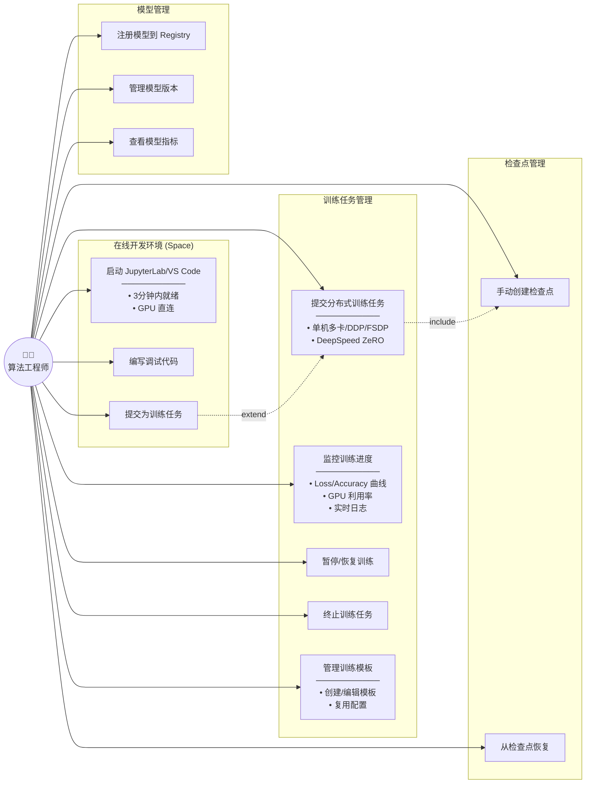
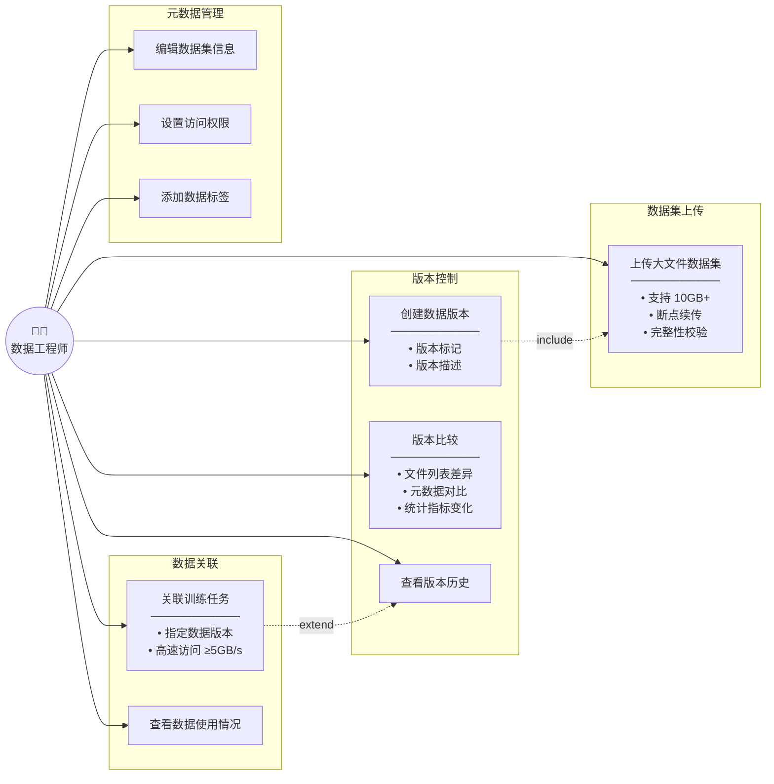
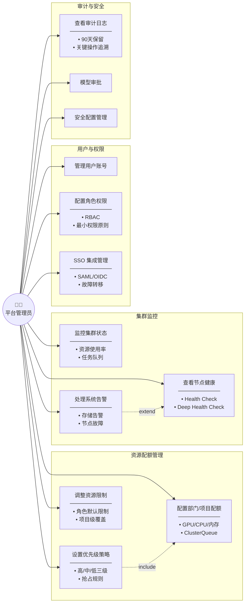
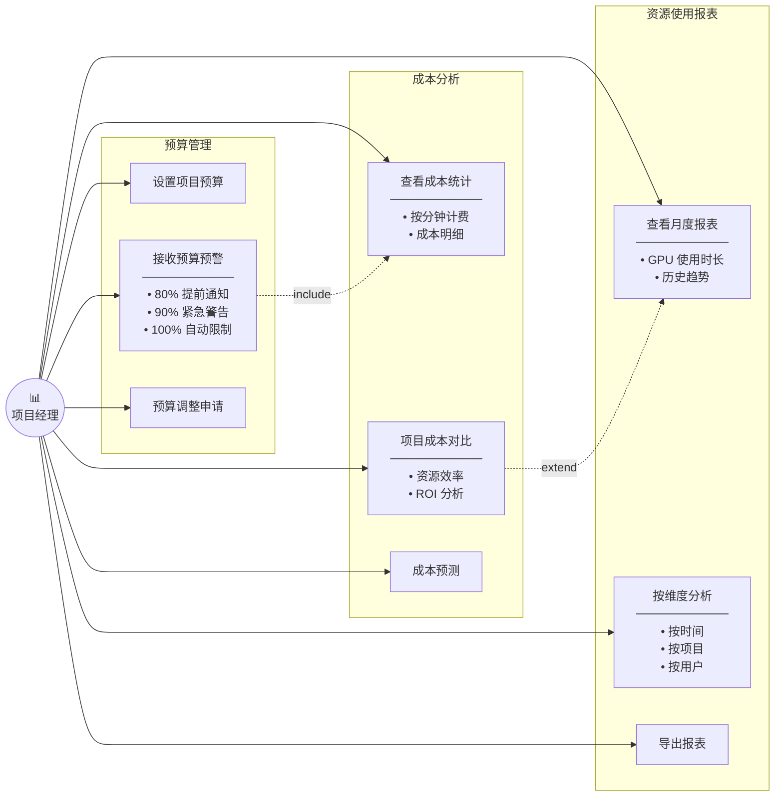
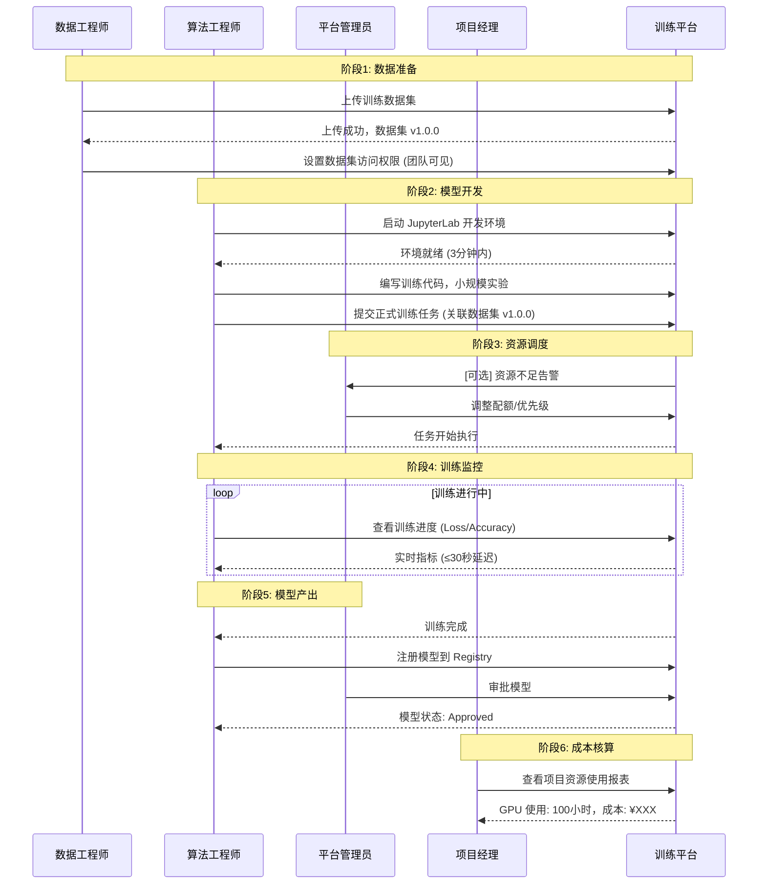
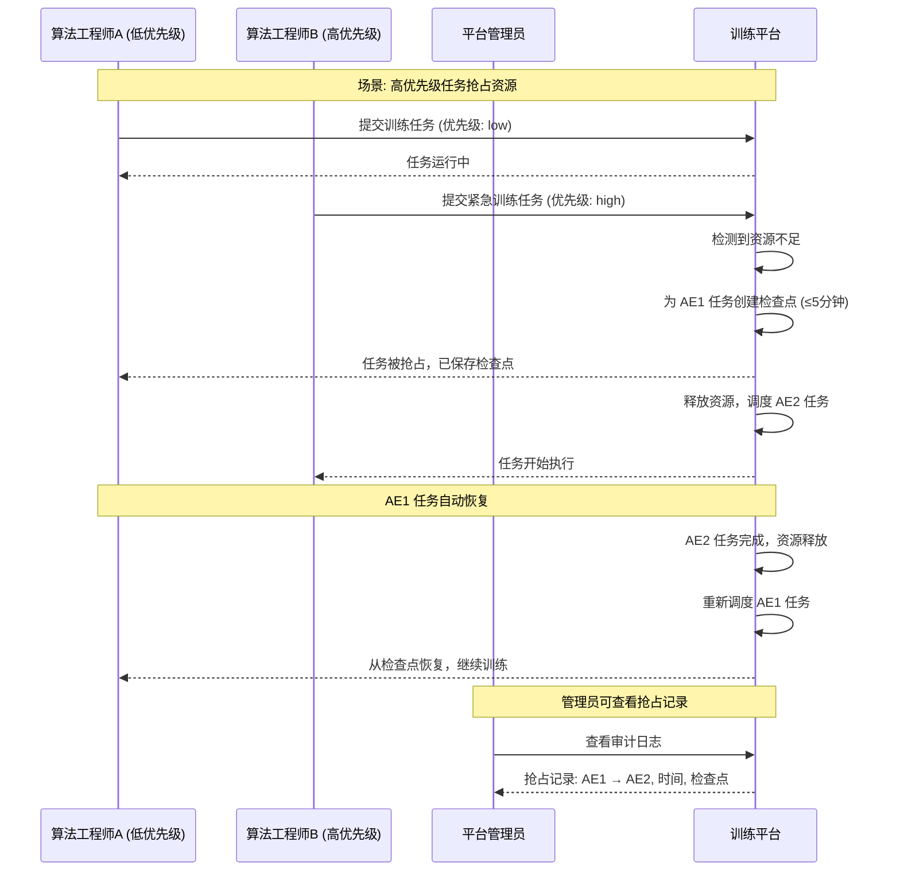

# AI 训练平台用户角色场景分析

**文档版本**: 1.0
**创建日期**: 2026-01-15
**关联规范**: specs/001-ai-training-platform/spec.md

---

## 目录

1. [概述](#1-概述)
2. [用户角色定义](#2-用户角色定义)
3. [整体用例图](#3-整体用例图)
4. [角色详细分析](#4-角色详细分析)
   - [4.1 算法工程师](#41-算法工程师-algorithm-engineer)
   - [4.2 数据工程师](#42-数据工程师-data-engineer)
   - [4.3 平台管理员](#43-平台管理员-platform-administrator)
   - [4.4 项目经理](#44-项目经理-project-manager)
5. [权限矩阵](#5-权限矩阵)
6. [角色交互场景](#6-角色交互场景)
7. [RBAC 设计建议](#7-rbac-设计建议)

---

## 1. 概述

本文档基于 `spec.md` 中定义的 User Stories 和功能需求，系统分析 AI 训练平台的用户角色、使用场景和权限设计。平台面向企业级 AI 训练场景，支持多租户、分布式训练和成本管理。

### 1.1 平台定位

- **目标用户**: 企业 AI/ML 团队
- **核心价值**: 提升 GPU 利用率、降低训练成本、提高训练效率
- **技术基础**: AWS SageMaker HyperPod + Kubernetes + Kueue

### 1.2 用户角色概览

| 角色 | 英文名称 | 核心职责 | 优先级 |
|------|---------|---------|--------|
| 算法工程师 | Algorithm Engineer | 模型训练与实验 | P1 |
| 数据工程师 | Data Engineer | 数据集管理与版本控制 | P1 |
| 平台管理员 | Platform Administrator | 资源配额与集群运维 | P1 |
| 项目经理 | Project Manager | 成本分析与预算管理 | P2 |

---

## 2. 用户角色定义

### 2.1 角色层级关系

```
┌─────────────────────────────────────────────────────────────┐
│                      平台管理员 (Admin)                       │
│  ┌─────────────────────────────────────────────────────────┐│
│  │ • 全局资源配额管理    • 用户和角色管理                      ││
│  │ • 集群监控和告警      • 审计日志查看                        ││
│  │ • SSO 集成管理        • 模型审批                           ││
│  └─────────────────────────────────────────────────────────┘│
├─────────────────────────────────────────────────────────────┤
│                      项目经理 (PM)                           │
│  ┌─────────────────────────────────────────────────────────┐│
│  │ • 项目级成本查看      • 团队资源使用统计                    ││
│  │ • 预算预警接收        • 资源效率分析                        ││
│  └─────────────────────────────────────────────────────────┘│
├─────────────────────────────────────────────────────────────┤
│           算法工程师 / 数据工程师 (User)                      │
│  ┌──────────────────────┐  ┌──────────────────────────────┐ │
│  │ 算法工程师            │  │ 数据工程师                    │ │
│  │ • 训练任务管理        │  │ • 数据集上传                  │ │
│  │ • 在线开发环境        │  │ • 版本管理                    │ │
│  │ • 模型注册            │  │ • 数据关联                    │ │
│  └──────────────────────┘  └──────────────────────────────┘ │
└─────────────────────────────────────────────────────────────┘
```

### 2.2 角色与 User Story 映射

| User Story | 主要角色 | 优先级 | 核心场景 |
|------------|---------|--------|---------|
| US-1: 提交和监控分布式训练任务 | 算法工程师 | P1 | 训练任务全生命周期管理 |
| US-2: 管理和版本控制训练数据集 | 数据工程师 | P1 | 数据资产管理 |
| US-3: 配置资源配额和监控集群 | 平台管理员 | P1 | 资源治理 |
| US-4: 查看资源使用报表和成本分析 | 项目经理 | P2 | 成本透明 |
| US-5: 使用在线开发环境 | 算法工程师 | P2 | 快速实验 |

---

## 3. 整体用例图

### 3.1 系统用例全景图

```mermaid
graph TB
    subgraph 系统边界["AI 训练平台"]
        subgraph 训练管理["训练任务管理"]
            UC1["提交训练任务"]
            UC2["监控训练进度"]
            UC3["暂停/恢复训练"]
            UC4["终止训练任务"]
            UC5["查看训练日志"]
            UC6["管理训练模板"]
        end

        subgraph 开发环境["在线开发环境"]
            UC7["启动 JupyterLab"]
            UC8["启动 VS Code"]
            UC9["GPU 加速调试"]
            UC10["提交为训练任务"]
        end

        subgraph 数据管理["数据集管理"]
            UC11["上传数据集"]
            UC12["创建数据版本"]
            UC13["版本比较"]
            UC14["关联训练任务"]
        end

        subgraph 模型管理["模型管理"]
            UC15["注册模型"]
            UC16["模型版本控制"]
            UC17["模型审批"]
        end

        subgraph 资源管理["资源配额管理"]
            UC18["配置部门配额"]
            UC19["设置优先级策略"]
            UC20["调整资源限制"]
        end

        subgraph 监控运维["集群监控运维"]
            UC21["监控集群状态"]
            UC22["查看节点健康"]
            UC23["处理告警"]
            UC24["查看审计日志"]
        end

        subgraph 成本分析["成本分析"]
            UC25["查看使用报表"]
            UC26["成本分析"]
            UC27["预算管理"]
        end

        subgraph 用户管理["用户与权限"]
            UC28["用户管理"]
            UC29["角色权限配置"]
            UC30["SSO 集成管理"]
        end
    end

    AE(("🧑‍💻 算法工程师"))
    DE(("🧑‍🔬 数据工程师"))
    PA(("🧑‍💼 平台管理员"))
    PM(("📊 项目经理"))

    AE --> UC1
    AE --> UC2
    AE --> UC3
    AE --> UC4
    AE --> UC5
    AE --> UC6
    AE --> UC7
    AE --> UC8
    AE --> UC9
    AE --> UC10
    AE --> UC15
    AE --> UC16

    DE --> UC11
    DE --> UC12
    DE --> UC13
    DE --> UC14

    PA --> UC18
    PA --> UC19
    PA --> UC20
    PA --> UC21
    PA --> UC22
    PA --> UC23
    PA --> UC24
    PA --> UC28
    PA --> UC29
    PA --> UC30
    PA --> UC17

    PM --> UC25
    PM --> UC26
    PM --> UC27
```



---

## 4. 角色详细分析

### 4.1 算法工程师 (Algorithm Engineer)

#### 4.1.1 角色画像

| 属性 | 描述 |
|------|------|
| **职位** | ML Engineer / AI Researcher / Algorithm Developer |
| **技能** | Python, PyTorch, 分布式训练, 模型优化 |
| **日常工作** | 模型开发、训练调参、实验迭代、模型评估 |
| **痛点** | 资源等待时间长、环境配置复杂、训练中断数据丢失 |
| **期望** | 快速提交任务、实时监控、自动恢复、便捷实验环境 |

#### 4.1.2 用例图



#### 4.1.3 核心场景描述

**场景 1: 提交分布式训练任务**

| 项目 | 内容 |
|------|------|
| **前置条件** | 用户已登录，拥有训练资源配额 |
| **触发事件** | 用户点击"创建训练任务" |
| **主要流程** | 1. 选择训练模板或从头配置<br/>2. 指定训练脚本、数据集、资源需求<br/>3. 设置分布式策略 (DDP/FSDP/DeepSpeed)<br/>4. 提交任务 |
| **成功条件** | 任务成功提交，状态变为 Submitted |
| **异常处理** | 配额不足 → 提示等待或申请配额<br/>配置错误 → 返回错误详情 |

**场景 2: 监控训练进度**

| 项目 | 内容 |
|------|------|
| **前置条件** | 存在运行中的训练任务 |
| **触发事件** | 用户访问任务详情页 |
| **主要流程** | 1. 查看训练状态和进度<br/>2. 查看 Loss/Accuracy 曲线 (≤30秒刷新)<br/>3. 查看 GPU 利用率<br/>4. 查看实时日志 (<10秒延迟) |
| **成功条件** | 实时展示训练指标和日志 |
| **性能要求** | 指标刷新 ≤30秒，日志延迟 <10秒 |

**场景 3: 使用在线开发环境**

| 项目 | 内容 |
|------|------|
| **前置条件** | 用户已登录，开发环境配额未用尽 |
| **触发事件** | 用户点击"启动开发环境" |
| **主要流程** | 1. 选择环境类型 (JupyterLab/VS Code)<br/>2. 选择实例类型 (ml.g5.xlarge/2xlarge)<br/>3. 等待环境就绪 (≤3分钟)<br/>4. 进入开发环境编写代码 |
| **成功条件** | 环境启动成功，可访问 GPU |
| **资源限制** | 单用户 1 个实例，空闲 1 小时自动关闭 |

#### 4.1.4 资源配额

| 资源类型 | 默认限制 | 说明 |
|---------|---------|------|
| GPU | 按项目配额 | 计入项目 GPU 总配额 |
| CPU | 4-8 vCPU | 根据实例类型 |
| 内存 | 16-32 GB | 根据实例类型 |
| 存储 | 50 GB EBS | 开发环境持久化存储 |
| 开发环境 | 1 个实例 | 单用户同时运行限制 |

---

### 4.2 数据工程师 (Data Engineer)

#### 4.2.1 角色画像

| 属性 | 描述 |
|------|------|
| **职位** | Data Engineer / Data Scientist / ML Data Specialist |
| **技能** | 数据处理, ETL, 数据质量管理, 存储系统 |
| **日常工作** | 数据收集、清洗、标注、版本管理、数据分发 |
| **痛点** | 大文件上传困难、版本混乱、数据溯源困难 |
| **期望** | 稳定上传、清晰版本、快速关联训练 |

#### 4.2.2 用例图



#### 4.2.3 核心场景描述

**场景 1: 上传大文件数据集**

| 项目 | 内容 |
|------|------|
| **前置条件** | 用户已登录，有数据集创建权限 |
| **触发事件** | 用户点击"上传数据集" |
| **主要流程** | 1. 选择本地文件或目录<br/>2. 填写数据集元数据<br/>3. 开始分片上传 (支持断点续传)<br/>4. 系统校验数据完整性 (SHA-256) |
| **成功条件** | 上传成功率 ≥99%，数据完整性验证通过 |
| **性能要求** | 支持 10GB+ 文件，断点续传 |

**场景 2: 创建数据版本**

| 项目 | 内容 |
|------|------|
| **前置条件** | 数据集已存在 |
| **触发事件** | 用户点击"创建新版本" |
| **主要流程** | 1. 上传变更的文件<br/>2. 填写版本号和描述<br/>3. 系统记录版本差异<br/>4. 保存新版本 |
| **成功条件** | 新版本创建成功，版本历史可追溯 |
| **版本格式** | 语义化版本 (MAJOR.MINOR.PATCH) |

**场景 3: 版本比较**

| 项目 | 内容 |
|------|------|
| **前置条件** | 数据集存在多个版本 |
| **触发事件** | 用户选择两个版本进行比较 |
| **主要流程** | 1. 选择源版本和目标版本<br/>2. 系统计算差异<br/>3. 展示文件列表差异、元数据对比、统计指标变化 |
| **输出格式** | JSON (added_files, deleted_files, modified_files, metadata_diff, statistics_diff) |

#### 4.2.4 数据集版本比较输出示例

```json
{
  "source_version": "1.0.0",
  "target_version": "1.1.0",
  "added_files": [
    {"path": "images/new_category/", "count": 1500, "size": "2.3GB"}
  ],
  "deleted_files": [],
  "modified_files": [
    {"path": "labels.json", "old_checksum": "abc123", "new_checksum": "def456"}
  ],
  "metadata_diff": {
    "description": {"old": "初始版本", "new": "增加新类别数据"},
    "tags": {"added": ["v1.1", "new-category"], "removed": []}
  },
  "statistics_diff": {
    "total_files": {"old": 10000, "new": 11500},
    "total_size": {"old": "15.2GB", "new": "17.5GB"}
  }
}
```

---

### 4.3 平台管理员 (Platform Administrator)

#### 4.3.1 角色画像

| 属性 | 描述 |
|------|------|
| **职位** | Platform Admin / DevOps Engineer / SRE |
| **技能** | Kubernetes, AWS, 监控告警, 安全合规 |
| **日常工作** | 资源管理、用户管理、集群运维、故障处理 |
| **痛点** | 资源争抢严重、故障定位困难、审计追溯复杂 |
| **期望** | 灵活配额、实时告警、完整审计、自动化运维 |

#### 4.3.2 用例图



#### 4.3.3 核心场景描述

**场景 1: 配置部门资源配额**

| 项目 | 内容 |
|------|------|
| **前置条件** | 管理员已登录，有配额管理权限 |
| **触发事件** | 管理员进入配额管理页面 |
| **主要流程** | 1. 选择部门/项目<br/>2. 配置 GPU/CPU/内存配额<br/>3. 设置默认优先级<br/>4. 保存配置 |
| **成功条件** | 配置生效，新提交任务按配额限制调度 |
| **技术实现** | 通过 HyperPod Task Governance API 配置 ClusterQueue |

**场景 2: 处理资源抢占**

| 项目 | 内容 |
|------|------|
| **前置条件** | 集群资源紧张，存在高优先级任务 |
| **触发事件** | 高优先级任务提交 |
| **主要流程** | 1. 系统评估资源需求<br/>2. 识别可抢占的低优先级任务<br/>3. 为被抢占任务自动创建检查点<br/>4. 释放资源给高优先级任务<br/>5. 被抢占任务重新排队 |
| **成功条件** | 高优先级任务成功调度，低优先级任务数据不丢失 |
| **抢占时序** | 检查点保存 (≤5分钟) → Pod释放 (≤30秒) → 重新调度 |

**场景 3: 处理存储告警**

| 项目 | 内容 |
|------|------|
| **前置条件** | 存储使用率触发告警阈值 |
| **触发事件** | 系统发送存储告警 |
| **告警级别** | 80% 警告 → 90% 严重 → 95% 满载 |
| **处理流程** | 1. 查看存储使用详情<br/>2. 识别占用大户<br/>3. 触发检查点迁移/清理<br/>4. 必要时暂停新任务提交 |
| **自动化** | 80% 加速迁移，90% 紧急迁移，95% 暂停提交 |

#### 4.3.4 告警处理矩阵

| 告警类型 | 阈值 | 自动响应 | 管理员操作 |
|---------|------|---------|-----------|
| NVMe 存储 | 80% | 加速迁移到 FSx | 监控迁移进度 |
| NVMe 存储 | 90% | 紧急迁移 | 清理过期检查点 |
| FSx 存储 | 80% | 启动 S3 归档 | 审查数据集使用 |
| FSx 存储 | 90% | 自动扩容 (如启用) | 申请扩容或清理 |
| 节点故障 | NotReady | 自动恢复训练 | 检查硬件状态 |
| 调度超时 | 60s | 任务 Failed | 检查资源配额 |

---

### 4.4 项目经理 (Project Manager)

#### 4.4.1 角色画像

| 属性 | 描述 |
|------|------|
| **职位** | Project Manager / Team Lead / Department Head |
| **技能** | 项目管理, 预算规划, 资源协调 |
| **日常工作** | 项目进度跟踪、资源协调、成本控制、汇报 |
| **痛点** | 成本不透明、资源使用不可见、预算超支 |
| **期望** | 清晰报表、及时预警、成本优化建议 |

#### 4.4.2 用例图



#### 4.4.3 核心场景描述

**场景 1: 查看月度资源使用报表**

| 项目 | 内容 |
|------|------|
| **前置条件** | 项目经理已登录，有项目查看权限 |
| **触发事件** | 项目经理进入报表页面 |
| **主要流程** | 1. 选择项目和时间范围<br/>2. 查看 GPU 使用时长统计<br/>3. 查看成本明细<br/>4. 查看历史趋势图表 |
| **成功条件** | 展示完整的资源使用和成本数据 |
| **计费粒度** | 按分钟计费 |

**场景 2: 预算预警处理**

| 项目 | 内容 |
|------|------|
| **前置条件** | 项目已设置预算 |
| **触发事件** | 资源使用达到预算阈值 |
| **预警级别** | 80% 提前通知 → 90% 紧急警告 → 100% 自动限制 |
| **处理流程** | 1. 接收预警通知<br/>2. 分析资源使用明细<br/>3. 决定是否调整预算或限制使用 |
| **通知对象** | 项目经理 + 任务提交者 |

#### 4.4.4 报表维度

| 维度 | 指标 | 说明 |
|------|------|------|
| 时间 | 日/周/月/季度 | 资源使用趋势 |
| 项目 | 各项目资源消耗 | 项目间对比 |
| 用户 | 个人资源使用 | 识别高消耗用户 |
| 任务类型 | 训练/开发环境 | 资源分布分析 |
| 优先级 | 高/中/低 | 紧急任务占比 |

---

## 5. 权限矩阵

### 5.1 功能权限矩阵

| 功能模块 | 操作 | 算法工程师 | 数据工程师 | 项目经理 | 平台管理员 |
|---------|------|:----------:|:----------:|:--------:|:----------:|
| **训练任务** | 创建 | ✅ | ❌ | ❌ | ✅ |
| | 查看 (自己的) | ✅ | ❌ | ✅ | ✅ |
| | 查看 (团队的) | ⚪ | ❌ | ✅ | ✅ |
| | 暂停/恢复 | ✅ | ❌ | ❌ | ✅ |
| | 终止 | ✅ | ❌ | ❌ | ✅ |
| **数据集** | 上传 | ⚪ | ✅ | ❌ | ✅ |
| | 查看 | ✅ | ✅ | ✅ | ✅ |
| | 创建版本 | ⚪ | ✅ | ❌ | ✅ |
| | 删除 | ❌ | ⚪ | ❌ | ✅ |
| **模型** | 注册 | ✅ | ❌ | ❌ | ✅ |
| | 查看 | ✅ | ✅ | ✅ | ✅ |
| | 审批 | ❌ | ❌ | ❌ | ✅ |
| | 部署 | ❌ | ❌ | ❌ | ✅ |
| **开发环境** | 创建 | ✅ | ⚪ | ❌ | ✅ |
| | 使用 | ✅ | ⚪ | ❌ | ✅ |
| **资源配额** | 查看 | ✅ | ✅ | ✅ | ✅ |
| | 配置 | ❌ | ❌ | ❌ | ✅ |
| **成本报表** | 查看个人 | ✅ | ✅ | ✅ | ✅ |
| | 查看项目 | ❌ | ❌ | ✅ | ✅ |
| | 查看全局 | ❌ | ❌ | ❌ | ✅ |
| **用户管理** | 查看 | ❌ | ❌ | ⚪ | ✅ |
| | 创建/编辑 | ❌ | ❌ | ❌ | ✅ |
| **审计日志** | 查看 | ❌ | ❌ | ❌ | ✅ |

**图例**: ✅ 完全权限 | ⚪ 有限权限 | ❌ 无权限

### 5.2 数据访问范围

| 角色 | 训练任务 | 数据集 | 模型 | 成本数据 |
|------|---------|-------|------|---------|
| 算法工程师 | 自己创建的 | 项目/团队共享的 | 自己注册的 | 个人使用 |
| 数据工程师 | 只读 (关联数据的) | 项目/团队的 | 只读 | 个人使用 |
| 项目经理 | 项目内所有 | 项目内所有 | 项目内所有 | 项目级汇总 |
| 平台管理员 | 全平台 | 全平台 | 全平台 | 全平台 |

---

## 6. 角色交互场景

### 6.1 典型工作流: 模型训练全流程



### 6.2 异常处理场景: 资源抢占



---

## 7. RBAC 设计建议

### 7.1 角色定义

```yaml
# 角色定义示例 (伪代码)
roles:
  - name: admin
    description: 平台管理员
    permissions:
      - resource: "*"
        actions: ["*"]

  - name: project_manager
    description: 项目经理
    permissions:
      - resource: "training_jobs"
        actions: ["read"]
        scope: "project"
      - resource: "cost_reports"
        actions: ["read"]
        scope: "project"
      - resource: "budgets"
        actions: ["read", "update"]
        scope: "project"

  - name: ml_engineer
    description: 算法工程师
    permissions:
      - resource: "training_jobs"
        actions: ["create", "read", "update", "delete"]
        scope: "own"
      - resource: "spaces"
        actions: ["create", "read", "delete"]
        scope: "own"
      - resource: "models"
        actions: ["create", "read"]
        scope: "own"
      - resource: "datasets"
        actions: ["read"]
        scope: "project"

  - name: data_engineer
    description: 数据工程师
    permissions:
      - resource: "datasets"
        actions: ["create", "read", "update", "delete"]
        scope: "project"
      - resource: "training_jobs"
        actions: ["read"]
        scope: "project"
```

### 7.2 权限继承关系

```
admin
  └── 继承所有权限

project_manager
  └── 继承 ml_engineer 的读取权限
  └── 继承 data_engineer 的读取权限
  └── 额外: 项目级成本查看

ml_engineer
  └── 训练任务完整权限 (own scope)
  └── 开发环境完整权限 (own scope)
  └── 数据集只读权限 (project scope)

data_engineer
  └── 数据集完整权限 (project scope)
  └── 训练任务只读权限 (project scope)
```

### 7.3 实现建议

1. **使用 Kubernetes RBAC**: 底层资源访问控制
2. **应用层 RBAC**: 业务逻辑权限控制
3. **SSO 集成**: 企业身份映射到平台角色
4. **审计日志**: 记录所有权限相关操作

---

## 附录

### A. 术语对照表

| 中文术语 | 英文术语 | 说明 |
|---------|---------|------|
| 算法工程师 | Algorithm Engineer | 负责模型训练的技术人员 |
| 数据工程师 | Data Engineer | 负责数据管理的技术人员 |
| 平台管理员 | Platform Administrator | 负责平台运维的管理人员 |
| 项目经理 | Project Manager | 负责项目管理的管理人员 |
| 训练任务 | Training Job | 模型训练作业 |
| 数据集 | Dataset | 训练数据集合 |
| 检查点 | Checkpoint | 训练状态快照 |
| 资源配额 | Resource Quota | 资源使用限制 |
| 开发空间 | Space | 在线开发环境 |

### B. 相关文档

- [功能规范](../specs/001-ai-training-platform/spec.md)
- [数据模型](../specs/001-ai-training-platform/data-model.md)
- [实施计划](../specs/001-ai-training-platform/plan.md)

### C. 版本历史

| 版本 | 日期 | 作者 | 变更说明 |
|------|------|------|---------|
| 1.0 | 2026-01-15 | AI Assistant | 初始版本 |
