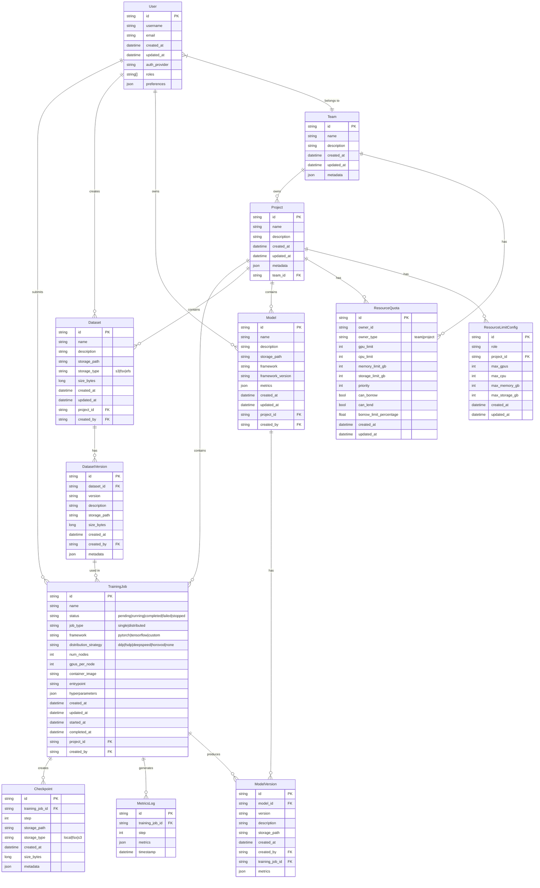
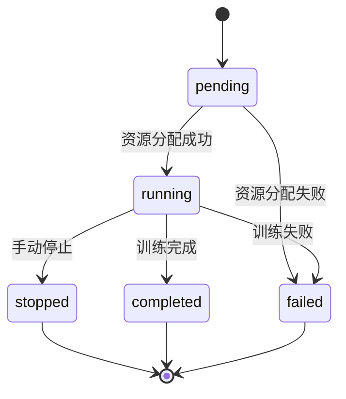

# 数据模型: 企业级AI训练平台

**日期**: 2025-12-23 | **特性分支**: `001-ai-training-platform`

## 实体关系图

## 核心实体说明

### 用户与认证实体

#### User (用户)

用户表示平台的登录账户，具有不同的角色和权限。

| 属性 | 类型 | 描述 | 验证规则 |
|------|------|------|----------|
| id | string | 唯一标识符 (UUID) | 必填，唯一 |
| username | string | 用户名 | 必填，唯一，3-50字符 |
| email | string | 电子邮件 | 必填，唯一，有效邮箱格式 |
| created_at | datetime | 创建时间 | 系统生成 |
| updated_at | datetime | 最后更新时间 | 系统生成 |
| auth_provider | string | 认证提供方 (local, ldap, oauth) | 必填 |
| roles | string[] | 用户角色列表 | 非空数组 |
| preferences | json | 用户偏好设置 | 有效JSON |

**状态转换**: 无特定状态转换

#### Team (团队)

团队代表组织内的部门或团队，拥有资源配额和项目。

| 属性 | 类型 | 描述 | 验证规则 |
|------|------|------|----------|
| id | string | 唯一标识符 (UUID) | 必填，唯一 |
| name | string | 团队名称 | 必填，唯一，2-100字符 |
| description | string | 团队描述 | 可选，0-500字符 |
| created_at | datetime | 创建时间 | 系统生成 |
| updated_at | datetime | 最后更新时间 | 系统生成 |
| metadata | json | 附加元数据 | 有效JSON |

**状态转换**: 无特定状态转换

#### Project (项目)

项目是团队内的工作单元，包含训练任务、数据集和模型。

| 属性 | 类型 | 描述 | 验证规则 |
|------|------|------|----------|
| id | string | 唯一标识符 (UUID) | 必填，唯一 |
| name | string | 项目名称 | 必填，2-100字符 |
| description | string | 项目描述 | 可选，0-1000字符 |
| created_at | datetime | 创建时间 | 系统生成 |
| updated_at | datetime | 最后更新时间 | 系统生成 |
| metadata | json | 附加元数据 | 有效JSON |
| team_id | string | 所属团队ID | 必填，有效的团队ID |

**状态转换**: 无特定状态转换

### 资源管理实体

#### ResourceQuota (资源配额)

定义团队或项目可使用的计算资源限制和优先级。

| 属性 | 类型 | 描述 | 验证规则 |
|------|------|------|----------|
| id | string | 唯一标识符 (UUID) | 必填，唯一 |
| owner_id | string | 所有者ID (团队或项目) | 必填 |
| owner_type | string | 所有者类型 (team/project) | 必填，枚举值 |
| gpu_limit | int | GPU数量限制 | 必填，≥0 |
| cpu_limit | int | CPU核心数限制 | 必填，≥0 |
| memory_limit_gb | int | 内存限制(GB) | 必填，≥0 |
| storage_limit_gb | int | 存储限制(GB) | 必填，≥0 |
| priority | int | 资源优先级 (1-100) | 必填，1-100 |
| can_borrow | bool | 是否可借用资源 | 必填 |
| can_lend | bool | 是否可外借资源 | 必填 |
| borrow_limit_percentage | float | 可借用额度百分比 | 可选，0-500 |
| created_at | datetime | 创建时间 | 系统生成 |
| updated_at | datetime | 最后更新时间 | 系统生成 |

**状态转换**: 无特定状态转换

#### ResourceLimitConfig (资源限制配置)

基于用户角色和项目的默认资源限制配置。

| 属性 | 类型 | 描述 | 验证规则 |
|------|------|------|----------|
| id | string | 唯一标识符 (UUID) | 必填，唯一 |
| role | string | 用户角色 | 必填 |
| project_id | string | 项目ID | 必填，有效的项目ID |
| max_gpus | int | 最大GPU数量 | 必填，≥0 |
| max_cpu | int | 最大CPU核心数 | 必填，≥0 |
| max_memory_gb | int | 最大内存(GB) | 必填，≥0 |
| max_storage_gb | int | 最大存储(GB) | 必填，≥0 |
| created_at | datetime | 创建时间 | 系统生成 |
| updated_at | datetime | 最后更新时间 | 系统生成 |

**状态转换**: 无特定状态转换

### 数据集管理实体

#### Dataset (数据集)

表示训练数据集的元数据，包含多个版本。

| 属性 | 类型 | 描述 | 验证规则 |
|------|------|------|----------|
| id | string | 唯一标识符 (UUID) | 必填，唯一 |
| name | string | 数据集名称 | 必填，2-100字符 |
| description | string | 数据集描述 | 可选，0-1000字符 |
| storage_path | string | 存储路径 | 必填 |
| storage_type | string | 存储类型 (s3/fsx/efs) | 必填，枚举值 |
| size_bytes | long | 数据集大小(字节) | 必填，≥0 |
| created_at | datetime | 创建时间 | 系统生成 |
| updated_at | datetime | 最后更新时间 | 系统生成 |
| project_id | string | 所属项目ID | 必填，有效的项目ID |
| created_by | string | 创建者ID | 必填，有效的用户ID |

**状态转换**: 无特定状态转换

#### DatasetVersion (数据集版本)

表示数据集的特定版本，包含版本特定的元数据和存储路径。

| 属性 | 类型 | 描述 | 验证规则 |
|------|------|------|----------|
| id | string | 唯一标识符 (UUID) | 必填，唯一 |
| dataset_id | string | 数据集ID | 必填，有效的数据集ID |
| version | string | 版本号 (语义化版本) | 必填，有效的版本号 |
| description | string | 版本描述 | 可选，0-1000字符 |
| storage_path | string | 版本特定存储路径 | 必填 |
| size_bytes | long | 版本大小(字节) | 必填，≥0 |
| created_at | datetime | 创建时间 | 系统生成 |
| created_by | string | 创建者ID | 必填，有效的用户ID |
| metadata | json | 版本元数据 | 有效JSON |

**状态转换**: 无特定状态转换

### 训练任务实体

#### TrainingJob (训练任务)

表示AI模型训练作业，包含配置、状态和资源需求。

| 属性 | 类型 | 描述 | 验证规则 |
|------|------|------|----------|
| id | string | 唯一标识符 (UUID) | 必填，唯一 |
| name | string | 任务名称 | 必填，2-100字符 |
| status | string | 任务状态 | 必填，枚举值 |
| job_type | string | 任务类型 (single/distributed) | 必填，枚举值 |
| framework | string | 使用框架 | 必填 |
| distribution_strategy | string | 分布式策略 | job_type为distributed时必填 |
| num_nodes | int | 节点数量 | 必填，≥1 |
| gpus_per_node | int | 每节点GPU数 | 必填，≥0 |
| container_image | string | 容器镜像 | 必填 |
| entrypoint | string | 入口命令 | 必填 |
| hyperparameters | json | 超参数 | 有效JSON |
| created_at | datetime | 创建时间 | 系统生成 |
| updated_at | datetime | 更新时间 | 系统生成 |
| started_at | datetime | 开始时间 | 开始时系统生成 |
| completed_at | datetime | 完成时间 | 完成时系统生成 |
| project_id | string | 所属项目ID | 必填，有效的项目ID |
| created_by | string | 创建者ID | 必填，有效的用户ID |

**状态转换**:

#### Checkpoint (检查点)

表示训练过程中的模型检查点。

| 属性 | 类型 | 描述 | 验证规则 |
|------|------|------|----------|
| id | string | 唯一标识符 (UUID) | 必填，唯一 |
| training_job_id | string | 训练任务ID | 必填，有效的训练任务ID |
| step | int | 训练步骤 | 必填，≥0 |
| storage_path | string | 存储路径 | 必填 |
| storage_type | string | 存储类型 (local/fsx/s3) | 必填，枚举值 |
| created_at | datetime | 创建时间 | 系统生成 |
| size_bytes | long | 检查点大小(字节) | 必填，≥0 |
| metadata | json | 检查点元数据 | 有效JSON |

**状态转换**: 无特定状态转换

#### MetricsLog (指标日志)

记录训练过程中的指标数据。

| 属性 | 类型 | 描述 | 验证规则 |
|------|------|------|----------|
| id | string | 唯一标识符 (UUID) | 必填，唯一 |
| training_job_id | string | 训练任务ID | 必填，有效的训练任务ID |
| step | int | 训练步骤 | 必填，≥0 |
| metrics | json | 指标数据 | 必填，有效JSON |
| timestamp | datetime | 记录时间 | 系统生成 |

**状态转换**: 无特定状态转换

### 模型管理实体

#### Model (模型)

表示AI模型，包含多个版本。

| 属性 | 类型 | 描述 | 验证规则 |
|------|------|------|----------|
| id | string | 唯一标识符 (UUID) | 必填，唯一 |
| name | string | 模型名称 | 必填，2-100字符 |
| description | string | 模型描述 | 可选，0-1000字符 |
| storage_path | string | 基础存储路径 | 必填 |
| framework | string | 模型框架 | 必填 |
| framework_version | string | 框架版本 | 必填 |
| metrics | json | 性能指标 | 有效JSON |
| created_at | datetime | 创建时间 | 系统生成 |
| updated_at | datetime | 最后更新时间 | 系统生成 |
| project_id | string | 所属项目ID | 必填，有效的项目ID |
| created_by | string | 创建者ID | 必填，有效的用户ID |

**状态转换**: 无特定状态转换

#### ModelVersion (模型版本)

表示模型的特定版本，通常由训练任务生成。

| 属性 | 类型 | 描述 | 验证规则 |
|------|------|------|----------|
| id | string | 唯一标识符 (UUID) | 必填，唯一 |
| model_id | string | 模型ID | 必填，有效的模型ID |
| version | string | 版本号 (语义化版本) | 必填，有效的版本号 |
| description | string | 版本描述 | 可选，0-1000字符 |
| storage_path | string | 版本特定存储路径 | 必填 |
| created_at | datetime | 创建时间 | 系统生成 |
| created_by | string | 创建者ID | 必填，有效的用户ID |
| training_job_id | string | 生成此版本的训练任务ID | 可选，有效的训练任务ID |
| metrics | json | 版本特定性能指标 | 有效JSON |

**状态转换**: 无特定状态转换

## 数据存储方案

### 存储分层设计

企业级AI训练平台采用分层存储设计，根据数据类型和访问模式选择最合适的存储系统：

1. **训练数据集存储**:
   - **主存储**: Amazon FSx for Lustre
     - 提供高吞吐、低延迟的并行文件访问
     - 作为训练时的主数据源
     - 支持大规模、高性能数据访问
   - **归档存储**: Amazon S3
     - 存储原始数据集和长期保存的版本
     - 成本优化的大容量存储
     - 数据集在训练前会预热到FSx

2. **模型与检查点存储**:
   - **分层检查点存储**:
     - **一级缓存**: 本地NVMe存储
       - 最新检查点快速访问
       - 高频自动保存点
     - **二级存储**: FSx for Lustre
       - 中间检查点存储
       - 训练恢复主要来源
     - **三级存储**: Amazon S3
       - 长期检查点存档
       - 完整版本历史

3. **代码与配置存储**:
   - **主存储**: Amazon EFS
     - 共享代码库和配置文件
     - 支持多用户并发访问
     - 持久化跨会话状态

### 数据备份与保留策略

1. **数据集备份**:
   - 所有上传的原始数据集保存在S3中的不可变存储桶
   - 主要数据集版本设置版本保留策略，防止意外删除
   - 数据集元数据定期备份到独立存储

2. **模型与检查点备份**:
   - 重要模型版本的多区域备份
   - 自动检查点清理策略：
     - 本地NVMe: 只保留最新N个检查点
     - FSx: 按间隔保留检查点(如每小时一个)
     - S3: 长期保留里程碑版本

3. **系统数据备份**:
   - 数据库定期快照
   - 配置和用户数据的版本控制
   - 审计日志的长期归档