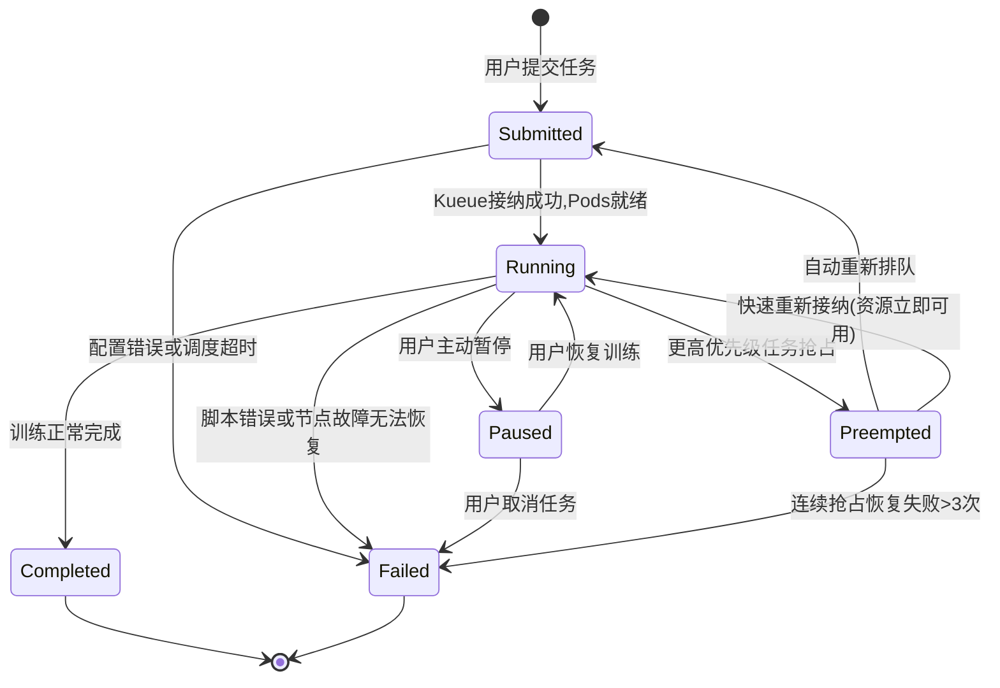

# Feature Specification: 企业级AI训练平台

**Feature Branch**: `001-ai-training-platform`
**Created**: 2025-12-23
**Status**: Draft
**Input**: User description: "基于需求分析文档构建企业级AI训练平台，支持模型训练、算力调度、数据管理、多租户和成本核算，目标是提升GPU资源利用率、降低训练成本并提高训练效率"

## Clarifications

### Session 2025-12-23
- Q: 当配额调整或高优先级任务导致低优先级任务被抢占时，如何保证数据不丢失？ → A: 在任务被抢占前自动创建检查点，确保数据不丢失
- Q: 训练任务资源限制策略应如何设置？ → A: 根据用户角色和项目设置默认限制，并允许管理员调整

### Session 2026-01-02
- Q: 分布式训练任务的自动检查点创建的最优时间间隔是多少? → A: 每10-15分钟一次检查点，平衡恢复时间和存储性能
- Q: 多租户资源调度的优先级级别应该如何定义? → A: 三级优先级(高/中/低)，平衡灵活性和复杂度
- Q: 用户身份认证机制应该采用什么方式? → A: 企业SSO(SAML/OIDC)集成 + 本地账号备用，实现统一身份管理
- Q: 成本核算的计费时间粒度应该是多少? → A: 按分钟计费，符合云计算标准实践，精确且开销可控
- Q: 预算预警的阈值应该如何设置? → A: 多级预警(80%/90%/100%)，提供渐进式预警机制

## User Scenarios & Testing *(mandatory)*

### User Story 1 - 算法工程师提交和监控分布式训练任务 (Priority: P1)

算法工程师通过平台提交PyTorch分布式训练任务，系统自动调度合适的GPU资源并分配计算任务，工程师可以实时监控训练进度、指标和资源利用率。

**Why this priority**: 训练任务提交与监控是平台最核心的功能，直接影响日常工作效率和模型迭代速度。

**Independent Test**: 可以通过算法工程师创建并提交分布式训练任务，然后监控整个训练过程来验证。这个功能单独即可交付核心价值：实现模型训练。

**Acceptance Scenarios**:

1. **Given** 算法工程师已登录平台并拥有训练资源配额，**When** 提交包含分布式训练配置的PyTorch训练任务，**Then** 系统成功接收任务并将其分配到多个GPU节点上开始训练
2. **Given** 训练任务正在进行，**When** 算法工程师访问任务详情页，**Then** 实时显示训练状态、Loss曲线、GPU利用率和日志（指标刷新间隔≤30秒，日志流延迟<10秒）
3. **Given** 训练任务中断（如节点故障），**When** 系统检测到故障，**Then** 训练任务从最近检查点自动恢复继续训练
4. **Given** 算法工程师首次提交训练任务，**When** 系统检查资源限制，**Then** 应用基于用户角色和所属项目的默认资源限制

---

### User Story 2 - 数据工程师管理和版本控制训练数据集 (Priority: P1)

数据工程师上传、管理大规模训练数据集，创建数据版本，并将数据集关联到特定训练任务。

**Why this priority**: 高质量训练数据是AI模型成功的关键，数据管理能力对训练结果有直接影响。

**Independent Test**: 可以通过数据工程师上传数据集、创建版本并关联到训练任务来验证。单独提供数据管理价值：实现数据资产管理。

**Acceptance Scenarios**:

1. **Given** 数据工程师已登录平台，**When** 上传10GB大文件数据集，**Then** 系统支持断点续传并将数据保存到分布式存储
2. **Given** 现有数据集已存在，**When** 数据工程师创建新版本并标记，**Then** 系统保存新版本并记录版本差异
3. **Given** 算法工程师创建训练任务，**When** 选择特定版本的数据集，**Then** 系统正确关联数据集并在训练时提供高速访问（单任务数据读取吞吐量≥5GB/s，基于FSx for Lustre单客户端访问能力）

---

### User Story 3 - 平台管理员配置资源配额和监控集群 (Priority: P1)

平台管理员为不同部门/项目分配GPU资源配额，设置任务优先级策略，并监控整体集群运行状态。

**Why this priority**: 多租户资源管理是企业环境中确保资源公平使用和提高利用率的基础能力。

**Independent Test**: 可以通过管理员配置不同部门配额，并验证各部门能否按配额使用资源来测试。提供独立价值：实现资源治理。

**Acceptance Scenarios**:

1. **Given** 管理员已登录平台，**When** 为市场部分配50个GPU配额并设置较低优先级，**Then** 系统记录配置并限制该部门同时使用的GPU数量
2. **Given** 集群资源紧张，**When** 研发部提交高优先级任务，**Then** 系统能够自动抢占市场部低优先级任务的资源，并在抢占前自动为低优先级任务创建检查点
3. **Given** 管理员查看监控面板，**When** 检查集群状态，**Then** 可以看到资源使用率、任务队列和每个部门的使用情况
4. **Given** 管理员需要调整资源限制，**When** 为特定角色或项目修改默认资源限制，**Then** 新设置立即生效并应用于新提交的训练任务

---

### User Story 4 - 项目经理查看资源使用报表和成本分析 (Priority: P2)

项目经理访问平台生成的资源使用报表，分析项目GPU使用量和成本，并进行预算规划。

**Why this priority**: 成本管理和透明度对企业级平台至关重要，但依赖于前三个核心功能的实现。

**Independent Test**: 可以通过项目经理查看特定时间段内项目资源使用报表和成本数据来验证。提供独立价值：实现成本透明和管理。

**Acceptance Scenarios**:

1. **Given** 项目经理已登录平台，**When** 查看项目A的月度资源使用报表，**Then** 显示GPU使用时长、成本和历史趋势
2. **Given** 项目经理查看成本分析页面，**When** 比较多个项目的资源效率，**Then** 系统提供每个项目训练时长与模型性能提升的比率
3. **Given** 项目预算使用率到达预警阈值(80%、90%或100%)，**When** 新的训练任务提交或资源使用量更新，**Then** 系统根据阈值级别发送相应的预算预警通知给项目经理和提交者(80%为提前通知，90%为紧急警告，100%触发自动限制措施)

---

### User Story 5 - 算法工程师使用在线开发环境 (Priority: P2)

算法工程师通过平台提供的在线开发环境（JupyterLab/VS Code）进行模型开发和实验，直接连接到GPU资源。

**Why this priority**: 在线开发环境提供了便捷的实验能力，但作为辅助功能优先级低于核心训练和数据管理功能。

**Independent Test**: 可以通过算法工程师登录在线环境，创建笔记本并运行GPU加速代码来验证。提供独立价值：实现快速实验能力。

**Acceptance Scenarios**:

1. **Given** 算法工程师已登录平台，**When** 启动在线JupyterLab环境，**Then** 系统分配资源并在30秒内提供可用的开发环境
2. **Given** 工程师在JupyterLab中编写PyTorch代码，**When** 执行使用GPU的代码，**Then** 代码能直接访问已分配的GPU资源并加速执行
3. **Given** 工程师在开发环境中完成实验，**When** 点击"提交为训练任务"，**Then** 系统将代码转换为正式训练任务并提交到队列

---

### Edge Cases

- 当集群资源完全耗尽时，系统如何处理新提交的高优先级任务？
- **多个分布式训练任务竞争网络带宽时的处理**: 系统通过Kubernetes NetworkPolicy实现网络隔离,利用AWS EFA高性能网络拓扑(每节点400-3200 Gbps带宽)和HyperPod集群的网络优化,确保分布式训练任务间不会相互影响。关键机制包括:(1) Pod级网络QoS配置 (2) 训练任务调度时考虑网络拓扑亲和性 (3) 实时网络性能监控和告警
- **当用户提交的任务耗费资源但长期没有进展(训练卡住)时的处理**: 系统实现智能超时检测机制,监控训练任务的指标进度(如Loss值、Accuracy等)。如果任务在可配置的时间窗口内(默认30分钟)没有指标更新或指标无明显变化(变化率<0.1%),系统将:(1) 发送告警通知给任务提交者 (2) 标记任务为"疑似卡住"状态 (3) 提供手动终止或自动终止选项(需管理员配置) (4) 记录详细诊断日志用于问题排查
- 当单个节点网络中断但未完全故障时，分布式训练如何正确响应？
- 当配额调整导致正在运行的低优先级任务需要被抢占时，系统将在抢占前自动创建检查点，确保数据不丢失

## Training Job State Model *(mandatory)*

本系统采用双层状态模型,将底层Kueue调度状态映射到上层用户友好的训练任务状态。

### 用户层状态定义

训练任务(TrainingJob)在用户视角有以下6种状态:

1. **Submitted**: 任务已提交,正在等待资源分配和调度
   - 包含子阶段: 配额等待 → 接纳等待 → Pod启动
   - 用户操作: 可取消任务

2. **Running**: 训练正在执行
   - 训练进程正在运行,产生指标和日志
   - 系统定期创建检查点(默认10-15分钟间隔)
   - 用户操作: 可暂停、终止任务

3. **Paused**: 用户主动暂停训练
   - 保留Pod资源但停止训练进程
   - 检查点已保存
   - 用户操作: 可恢复或终止任务

4. **Preempted**: 被更高优先级任务抢占
   - 系统在抢占前自动创建检查点
   - 资源已释放,任务自动重新排队
   - 系统行为: 自动尝试从检查点恢复

5. **Completed**: 训练成功完成
   - 训练脚本正常退出
   - 模型已保存,指标已记录
   - 终态,不可转换

6. **Failed**: 训练失败,无法恢复
   - 配置错误、脚本错误、连续恢复失败
   - 终态,需用户修复后重新提交
   - 错误信息记录在任务详情中

### 状态转换图



### 底层Kueue状态映射

TrainingJob状态由底层Kueue Workload状态驱动:

#### Submitted状态的细分阶段

| Kueue Condition | 显示给用户的子状态 | 说明 |
|----------------|------------------|------|
| QuotaReserved=False | "等待配额" | 当前配额已满,排队等待 |
| QuotaReserved=True, Admitted=False | "等待接纳" | 配额已预留,等待调度器接纳 |
| Admitted=True, PodsReady=False | "启动Pod中" | Gang Scheduling进行中 |

用户在UI看到的是**Submitted**状态,但可通过详情查看具体阶段。

#### 抢占(Preemption)流程映射

**TrainingJob状态转换**: Running → Preempted

**触发条件**: Kueue Workload收到Evicted condition (reason: Preempted)

**系统行为**:
1. 检测到Evicted condition
2. 立即触发检查点创建(如果距上次检查点>5分钟)
3. 等待检查点完成(超时30秒则强制终止)
4. TrainingJob状态变更为Preempted
5. Kueue清理Pods,释放资源

**恢复流程1**: Preempted → Submitted → Running
- 系统自动将任务重新提交到队列
- Kueue Workload重新创建,进入QuotaReserved流程
- 从检查点恢复训练

**恢复流程2**: Preempted → Running (快速路径)
- Kueue快速重新接纳(资源立即可用)
- 从检查点恢复,继续训练

#### 故障场景映射

**节点故障**:
```
Kueue状态: PodsReady=False (部分Pod NotReady)
TrainingJob状态: 保持Running
系统行为:
  - 创建检查点(如果距上次创建>5分钟)
  - 等待Kubernetes重新调度失败的Pod
  - 在statusDetails中显示"正在从节点故障恢复中"
  - 如果超过5分钟未恢复 → TrainingJob变为Failed
```

**配置错误**:
```
Kueue状态: 无法创建Workload对象
TrainingJob状态: Submitted → Failed (立即转换)
失败原因: "配置验证失败: {具体错误}"
```

**训练脚本错误**:
```
Kueue状态: Finished=True (exit code != 0)
TrainingJob状态: Running → Failed
失败原因: "训练脚本异常退出: exit code {code}"
```

**连续抢占失败**:
```
场景: Preempted状态的任务连续3次恢复都被再次抢占
TrainingJob状态: Preempted → Failed
失败原因: "任务优先级过低,资源持续不足,已连续被抢占3次"
用户建议: "请提高任务优先级或在资源空闲时段提交"
```

### 状态转换规则与触发条件

| 转换 | 触发条件 | 系统行为 |
|------|---------|---------|
| Submitted → Running | Kueue: Admitted=True AND PodsReady=True | 开始训练,启动指标监控 |
| Submitted → Failed | 配置验证失败 OR 调度超时(>30分钟) OR 权限拒绝 | 记录失败原因,通知用户 |
| Running → Paused | 用户调用 POST /training-jobs/{id}/actions/pause | 保存检查点,停止训练进程,保留资源 |
| Running → Preempted | Kueue: Evicted=True (reason: Preempted) | 创建检查点,释放资源,自动重新排队 |
| Running → Completed | 训练脚本exit code=0 AND Kueue: Finished=True | 保存最终模型,记录指标,释放资源 |
| Running → Failed | 脚本exit code!=0 OR 节点故障无可用检查点 OR 连续恢复失败>3次 | 记录失败原因,保留最近检查点,释放资源 |
| Paused → Running | 用户调用 POST /training-jobs/{id}/actions/resume | 从检查点恢复,继续训练 |
| Paused → Failed | 用户调用 DELETE /training-jobs/{id} | 清理资源,标记为用户取消 |
| Preempted → Submitted | 系统自动重新提交(立即执行) | Workload重新创建,进入排队流程 |
| Preempted → Running | Kueue快速重新接纳(资源立即可用场景) | 跳过排队,直接从检查点恢复 |
| Preempted → Failed | 连续抢占恢复失败>3次 | 标记为优先级不足,停止自动恢复 |

### 与功能需求的对齐

#### FR-004 抢占式调度支持

> FR-004: 系统必须支持基于优先级的抢占式调度,采用三级优先级体系(高/中/低),高优先级任务可以抢占中低优先级任务的资源,中优先级任务可以抢占低优先级任务的资源,并在抢占前根据FR-010自动创建检查点保存训练状态

**实现映射**:
- **优先级体系**: 通过Kueue的PriorityClass实现(high/medium/low)
- **抢占机制**: Kueue的Preemption功能自动驱动
- **检查点保存**: 在检测到Evicted condition时立即触发(见"抢占流程映射")
- **状态管理**: Preempted状态清晰表达被抢占的任务,自动重新排队恢复

#### FR-010 自动检查点与断点续训

> FR-010: 系统必须实现自动检查点创建和断点续训功能,在以下场景自动触发检查点创建:(1)训练中断 (2)节点故障 (3)资源抢占 (4)用户手动触发 (5)定期自动创建(默认间隔10-15分钟)

**检查点触发场景映射**:
1. **训练中断** → 检测到Pods异常终止时触发
2. **节点故障** → 检测到PodsReady=False且持续>30秒时触发
3. **资源抢占** → 检测到Evicted condition (reason: Preempted)时立即触发
4. **用户手动触发** → API调用POST /training-jobs/{id}/checkpoints时触发
5. **定期创建** → Running状态下每10-15分钟定时触发

**断点续训实现**:
- Preempted → Submitted → Running: 从最新检查点自动恢复
- 节点故障恢复: 系统自动从检查点加载状态,继续训练
- 恢复时间目标: 5分钟内完成(符合SC-004)

### API状态字段定义

TrainingJob API响应示例:

**Submitted状态**:
```json
{
  "id": "job-12345",
  "name": "bert-training",
  "status": "Submitted",
  "statusReason": "Waiting for quota",
  "statusDetails": {
    "submittedPhase": "WaitingForQuota",
    "kueueWorkloadStatus": {
      "quotaReserved": false,
      "admitted": false,
      "message": "insufficient quota for gpu in flavor default-flavor"
    },
    "queuePosition": 3,
    "estimatedStartTime": "2026-01-02T10:15:00Z"
  },
  "createdAt": "2026-01-02T10:00:00Z",
  "updatedAt": "2026-01-02T10:05:00Z"
}
```

**Running状态**:
```json
{
  "id": "job-12345",
  "name": "bert-training",
  "status": "Running",
  "statusReason": null,
  "statusDetails": {
    "kueueWorkloadStatus": {
      "quotaReserved": true,
      "admitted": true,
      "podsReady": true
    },
    "lastCheckpoint": {
      "id": "ckpt-456",
      "createdAt": "2026-01-02T10:25:00Z",
      "reason": "PeriodicSnapshot"
    },
    "nextCheckpointTime": "2026-01-02T10:35:00Z",
    "runningDuration": "00:25:15"
  },
  "startedAt": "2026-01-02T10:10:00Z",
  "updatedAt": "2026-01-02T10:25:15Z"
}
```

**Preempted状态**:
```json
{
  "id": "job-12345",
  "name": "bert-training",
  "status": "Preempted",
  "statusReason": "Preempted by higher priority job",
  "statusDetails": {
    "kueueWorkloadStatus": {
      "admitted": true,
      "evicted": true,
      "evictionReason": "Preempted to accommodate workload UID:5c023c28 due to prioritization"
    },
    "preemptionCount": 1,
    "lastCheckpoint": {
      "id": "ckpt-789",
      "createdAt": "2026-01-02T10:30:00Z",
      "reason": "PreemptionTriggered"
    },
    "estimatedRecoveryTime": "2026-01-02T10:35:00Z"
  },
  "createdAt": "2026-01-02T10:00:00Z",
  "preemptedAt": "2026-01-02T10:30:15Z",
  "updatedAt": "2026-01-02T10:30:15Z"
}
```

**Failed状态**:
```json
{
  "id": "job-12345",
  "name": "bert-training",
  "status": "Failed",
  "statusReason": "Training script error: exit code 1",
  "statusDetails": {
    "kueueWorkloadStatus": {
      "finished": true,
      "finishReason": "Failed"
    },
    "failureCategory": "ScriptError",
    "errorLog": "RuntimeError: CUDA out of memory. Tried to allocate 2.00 GiB...",
    "lastCheckpoint": {
      "id": "ckpt-789",
      "createdAt": "2026-01-02T10:25:00Z",
      "reason": "PeriodicSnapshot"
    },
    "retryable": true,
    "suggestion": "请减少batch_size或启用梯度累积"
  },
  "createdAt": "2026-01-02T10:00:00Z",
  "failedAt": "2026-01-02T10:32:45Z",
  "updatedAt": "2026-01-02T10:32:45Z"
}
```

### StatusDetails字段说明

**submittedPhase** (仅在status=Submitted时存在):
- `"WaitingForQuota"`: QuotaReserved=False,配额已满
- `"WaitingForAdmission"`: QuotaReserved=True, Admitted=False
- `"StartingPods"`: Admitted=True, PodsReady=False

**kueueWorkloadStatus** (所有状态都存在,方便高级用户调试):
- `quotaReserved`: boolean - 配额是否已预留
- `admitted`: boolean - 是否已被接纳到ClusterQueue
- `podsReady`: boolean - 所有Pod是否就绪
- `evicted`: boolean - 是否被驱逐
- `evictionReason`: string - 驱逐原因(如果evicted=true)
- `finished`: boolean - 是否已完成
- `finishReason`: string - 完成原因("Completed"或"Failed")
- `message`: string - Kueue状态详细消息

**preemptionCount**: integer - 任务被抢占的累计次数(用于判断是否超过阈值)

**failureCategory**: string - 失败分类,便于统计和诊断
- `"ConfigError"`: 配置验证失败
- `"ScriptError"`: 训练脚本错误
- `"NodeFailure"`: 节点故障无法恢复
- `"SchedulingTimeout"`: 调度超时
- `"PermissionDenied"`: 权限不足
- `"PreemptionExhausted"`: 连续抢占失败超过阈值

### 状态监控与指标

系统在Prometheus中记录以下状态转换指标:

```
# 状态分布
training_job_status{status="Submitted|Running|Paused|Preempted|Completed|Failed"}

# 状态转换计数
training_job_state_transitions_total{from_status="...", to_status="..."}

# 状态持续时间
training_job_status_duration_seconds{status="..."}

# 抢占相关指标
training_job_preemptions_total{priority="high|medium|low"}
training_job_preemption_recovery_duration_seconds
training_job_preemption_checkpoint_duration_seconds

# 失败原因分布
training_job_failures_total{failure_category="..."}
```

## Requirements *(mandatory)*

### Constitution Alignment

本规范所有功能需求的实现 MUST 遵循项目宪章 (constitution.md) 的核心原则，特别是：

- **Principle I.A (组件优先级)**: 所有技术组件选择必须遵循以下优先级：
  1. 首选: EKS 托管 Add-ons 和 HyperPod 原生能力
  2. 次选: AWS 托管服务
  3. 第三选: Kubernetes 生态兼容组件
  4. 避免: 自行实现 HyperPod 已提供的功能

- **Principle I.B (SDK-First)**: 所有与 SageMaker HyperPod 交互的功能实现 MUST 遵循 SDK 选择优先级：
  1. 首选: `sagemaker-hyperpod` SDK（仅限 Cluster, Training, Inference, Space 功能）
  2. 次选: AWS 原生 SDK (boto3, AWS SDK for Python)
  3. 第三选: 成熟的开源 SDK
  4. 最后: 自行实现

- **Principle XI (UI/UX Consistency)**: 所有前端实现 MUST 使用 AWS Cloudscape Design System

详细的组件选择和实现约束请参考各功能需求 (FR) 的具体说明。

### Functional Requirements

- **FR-001**: 系统必须支持用户提交单机和分布式PyTorch训练任务，明确支持以下训练模式（当前版本仅支持PyTorch框架）：
  - ✅ **支持**: 单机多卡(DataParallel) - 基础分布式能力，适合小规模训练
  - ✅ **支持**: DDP (DistributedDataParallel) - 推荐的多节点数据并行模式，性能优于DataParallel
  - ✅ **支持**: FSDP (Fully Sharded Data Parallel) - 适用于超大模型训练，支持参数分片
  - ✅ **支持**: DeepSpeed ZeRO (Stage 1/2/3) - 支持极大规模模型训练，提供内存优化和并行策略
  - ❌ **不支持**: Horovod、MegatronLM等其他框架（可在未来版本考虑）
  - 📋 **说明**: 每种训练模式对资源的要求和适用场景详见技术规格文档
  - 🔒 **技术约束**: (1)DataParallel 与 DDP 互斥，不能同时使用 (2)FSDP 与 DeepSpeed ZeRO 互斥，不能同时使用 (3)DDP 可以与 FSDP 组合使用（数据并行+模型分片） (4)DataParallel 仅适用于单机多卡场景，不支持与其他技术组合
  - 🎯 **选型建议**: 单机多卡推荐 DataParallel 或 DDP；多节点训练推荐 DDP；超大模型（>10B参数）推荐 FSDP 或 DeepSpeed ZeRO
  - 🔧 **实施约束**: MUST 使用 `sagemaker-hyperpod` SDK 的训练任务提交 API 实现，避免直接操作 Kubernetes API
- **FR-002**: 系统必须提供训练任务队列管理，包括任务提交、调度、暂停、恢复和终止功能
  - 🔧 **实施约束**: MUST 使用 `sagemaker-hyperpod` SDK 进行训练任务生命周期管理（创建、监控、暂停、恢复、终止）
- **FR-003**: 系统必须实现Gang Scheduling（组调度）机制，确保分布式训练任务的所有Pod在同一调度周期内被调度(时间窗口≤60秒)，所有Pod必须同时就绪后才能开始训练。具体实现机制采用HyperPod Training Operator的默认Gang Scheduling行为：
  - ⏱️ **调度窗口**: 所有Pod必须在60秒内达到就绪状态（基于HyperPod Training Operator默认配置）
  - 🔄 **失败处理**: 若超时或部分Pod调度失败，任务状态转为Failed，已创建的Pod自动清理
  - 🔁 **重试机制**: 遵循HyperPod Training Operator的默认重试策略（具体配置参考HyperPod官方文档）
  - 📊 **状态转换**: Pending → Scheduling → Running（全部就绪）或 Failed（超时/失败）
  - 📚 **参考文档**: [AWS SageMaker HyperPod Training Operator Documentation](https://docs.aws.amazon.com/sagemaker/latest/dg/hyperpod-training-operator.html)
  - 🔧 **实施约束**: MUST 使用 HyperPod Training Operator 的原生 Gang Scheduling 能力，通过 `sagemaker-hyperpod` SDK 配置训练任务以启用组调度
- **FR-004**: 系统必须支持基于优先级的抢占式调度，采用三级优先级体系(高/中/低)，高优先级任务可以抢占中低优先级任务的资源，中优先级任务可以抢占低优先级任务的资源，并在抢占前根据FR-010自动创建检查点保存训练状态。抢占时序保证：(1)抢占信号发出后,系统等待检查点创建完成后才释放资源 (2)检查点创建超时(默认5分钟)后强制抢占,记录警告日志 (3)强制抢占时保留上一个有效检查点,确保可恢复。优先级机制：(1)完全采用SageMaker HyperPod Task Governance原生优先级规则 (2)三级优先级映射到HyperPod的critical/high/medium级别 (3)同级任务排序依照HyperPod默认策略(基于提交时间和资源需求) (4)抢占规则遵循HyperPod原生行为,包括冷却期和最大抢占次数限制
  - 🔧 **实施约束**: MUST 使用 HyperPod Task Governance (Kueue) 的原生抢占机制，通过 `sagemaker-hyperpod` SDK 配置任务优先级和抢占策略
- **FR-005**: 系统必须提供大文件数据集的上传功能，支持断点续传和数据完整性校验
- **FR-006**: 系统必须实现数据集的版本控制功能，支持版本创建、标记和比较（版本比较包括文件列表差异、元数据对比和统计指标变化）
- **FR-007**: 系统必须提供训练任务级的实时监控功能，监控指标包括：(1)训练进度指标-Loss、Accuracy、Epoch/Step进度、学习率(Learning Rate) (2)资源利用率指标-GPU利用率、GPU显存使用率、CPU利用率、内存使用率 (3)性能指标-训练吞吐量(samples/sec)、迭代耗时 (4)可选高级指标-梯度范数(用户可选开启)。性能要求：训练指标刷新间隔≤30秒、日志流延迟<10秒、监控数据查询响应时间P99<2秒
  - 🔧 **实施约束**: MUST 使用 HyperPod Observability Add-on (Prometheus + Grafana) 进行指标采集和可视化，通过 Prometheus API 或 AWS SDK (boto3) 查询监控指标
- **FR-008**: 系统必须实现多租户隔离，支持按部门/项目分配资源配额
- **FR-009**: 系统必须提供资源使用统计和成本分析功能，支持按时间、项目和用户维度的数据查询，采用按分钟计费粒度进行成本核算，确保精确的资源使用成本追踪
- **FR-010**: 系统必须实现自动检查点创建和断点续训功能，在以下场景自动触发检查点创建：(1)训练中断 (2)节点故障 (3)资源抢占 (4)用户手动触发 (5)定期自动创建(默认间隔10-15分钟)，确保训练状态可恢复且故障时平均损失训练进度不超过7.5分钟。系统依赖 HyperPod 的 Auto-Resume 机制和 Health Check Agent 实现节点故障自动检测和训练任务自动恢复
  - 🔧 **实施约束**: MUST 使用 HyperPod Elastic Agent 的检查点管理能力和 Auto-Resume 机制，通过 `sagemaker-hyperpod` SDK 配置检查点策略和恢复机制
- **FR-011**: 系统必须实现分层检查点存储策略，采用三层存储架构(NVMe本地存储→FSx for Lustre→S3)，根据检查点创建时间自动分层，优化长时间训练的检查点写入性能和存储成本。实现细节:(1) 热检查点(创建时间最近的3个)保留在NVMe本地存储,提供最快访问 (2) 温检查点(创建时间第4-10个)自动迁移到FSx for Lustre (3) 冷检查点(创建序号>10个或创建时间超过72小时)自动归档到S3 (4) 迁移在训练任务空闲时段(检查点间隔期)异步执行 (5) S3保留最近30天的检查点,超期自动清理 (6) **存储满载处理**:当NVMe/FSx存储使用率>90%时触发紧急迁移至下一层,若所有层均满载则告警并暂停新检查点创建(保留最近1个) (7) **迁移失败回退**:迁移失败时保留原位置检查点,记录失败日志,下次迁移周期重试(最多3次),持续失败则触发告警 (8) **检查点完整性保护**:创建时计算SHA-256校验和,恢复前验证完整性,若损坏则自动尝试上一个有效检查点并告警
- **FR-012**: 系统必须提供JupyterLab/VS Code在线开发环境，支持GPU直连 (通过 Amazon SageMaker Spaces Add-on 实现)
  - 🔧 **实施约束**: MUST 使用 Amazon SageMaker Spaces Add-on 提供在线开发环境，通过 `sagemaker-hyperpod` SDK 管理 Spaces 的创建、配置和生命周期
- **FR-024**: 系统所有前端界面必须采用 AWS Cloudscape Design System 实现，确保UI组件、交互模式和视觉风格的一致性。具体要求包括：(1)使用Cloudscape组件库的标准组件(Button、Table、Form、Modal等) (2)遵循Cloudscape的设计模式和交互规范 (3)使用Cloudscape提供的主题和样式系统 (4)确保所有界面符合WCAG 2.1 AA级无障碍标准
  - 🔧 **实施约束**: MUST 使用 AWS Cloudscape Design System (@cloudscape-design/components) 作为唯一的 UI 组件库，禁止使用其他UI框架(如Material-UI、Ant Design等)
- **FR-025**: 系统基础设施和配置管理必须采用 GitOps 工作流，所有基础设施配置（Kubernetes manifests、Terraform 配置）和应用配置通过 Git 仓库管理，配置变更通过 Pull Request 审核后自动部署。系统必须使用声明式配置方式，支持配置版本控制、变更审计和自动化部署
  - 🔧 **实施约束**: MUST 使用 GitOps 工具（如 ArgoCD 或 Flux）实现配置自动同步和部署，所有配置文件必须存储在 Git 仓库中并通过 CI/CD 流程验证
- **FR-013**: 系统必须支持模型版本管理，包括模型存储、标记和比较功能
  - 🔧 **实施约束**: MUST 使用 SageMaker Model Registry 进行模型版本控制和治理，通过 AWS SDK (boto3) 或 `sagemaker-hyperpod` SDK 集成进行模型注册和管理
- **FR-014**: 系统必须提供全链路日志收集和查询功能。日志来源：(1)容器stdout/stderr (2)训练框架日志(PyTorch等) (3)系统事件日志(Pod生命周期、调度事件)。日志格式：JSON结构化格式,包含timestamp、level、job_id、pod_name、message字段。性能要求：日志保留期30天、查询响应时间P99<3秒、支持全文检索。敏感信息处理：由用户在训练代码中自行处理,系统不做自动脱敏
- **FR-015**: 系统必须实现完整的用户认证和权限控制，支持企业SSO(SAML/OIDC)集成与企业身份系统对接，同时提供本地账号作为备用认证方式，确保在SSO服务不可用时系统仍可正常运行。访问控制必须实现基于角色的访问控制（RBAC），遵循最小权限原则，确保用户仅能访问其职责范围内的资源和操作
- **FR-016**: 系统必须提供集群级资源使用监控仪表盘和告警功能，包括节点健康、GPU利用率和内存/网络利用率。节点健康监控依赖 HyperPod 的 Health Check Agent 进行自动健康检查和故障检测，支持 Deep Health Check 进行深度硬件和软件层面的健康验证
  - 🔧 **实施约束**: MUST 使用 HyperPod Observability Add-on (Prometheus + Grafana) 和 Amazon Managed Grafana 进行集群监控和可视化，通过 Prometheus API 或 AWS SDK (boto3) 查询集群级指标。节点健康状态由 HyperPod Health Check Agent 提供
- **FR-017**: 系统必须实现100%关键操作的审计日志记录，审计日志保留期≥90天，记录内容包括用户身份、操作时间、操作类型、操作对象和操作结果
- **FR-018**: 系统必须支持数据加密，包括静态数据加密（使用 S3 SSE-KMS）和传输中加密（所有网络通信使用 TLS 1.2 或更高版本）
- **FR-019**: 系统必须根据用户角色和项目设置训练任务的默认资源限制，并允许管理员进行调整
- **FR-020**: 系统必须在训练数据量接近存储系统容量时（剩余空间<10%）发出告警，并支持配置自动扩容或数据分层策略
- **FR-021**: 系统必须实现网络带宽管理和QoS策略，采用HyperPod默认网络隔离机制(EFA网络优化、Pod级网络命名空间隔离)，确保分布式训练任务间的网络隔离和性能保证。性能目标：网络延迟P99<10ms、带宽利用率>80%。可选扩展：支持用户通过任务配置自定义NetworkPolicy规则。隔离保证：完全依赖HyperPod网络隔离能力，隔离程度以HyperPod官方文档为准，任务间实际性能影响由底层基础设施决定
- **FR-022**: 系统必须实现训练任务超时和停滞检测机制。检测策略：(1)主检测指标为Loss(默认)或用户指定的单一指标 (2)停滞判定标准为主指标在可配置时间窗口(默认30分钟)内变化率<0.1% (3)其他指标异常仅记录日志供参考,不触发告警 (4)支持用户禁用停滞检测(适用于GAN/RL等Loss震荡的特殊训练场景)。触发后发送告警并提供自动/手动终止选项

### Key Entities

- **训练任务（TrainingJob）**: 表示一个AI模型训练作业，包含训练配置、资源需求、关联数据集、训练状态和指标数据
- **数据集（Dataset）**: 表示训练数据集合，包含元数据、版本信息、存储位置和使用权限
- **资源配额（ResourceQuota）**: 表示分配给特定团队/项目的计算资源限制，包含GPU数量、CPU核心、内存等资源指标和优先级信息(高/中/低三级优先级)
- **用户（User）**: 系统用户，包含身份信息、所属团队/项目、权限等级和资源使用记录
- **检查点（Checkpoint）**: 训练过程中保存的模型状态，包含存储位置、创建时间和相关训练指标
- **模型（Model）**: 训练产出的模型，包含版本信息、性能指标、部署状态和生命周期信息
- **资源限制配置（ResourceLimitConfig）**: 基于用户角色和项目的默认资源限制设置，包含最大GPU数、内存限制、存储空间等

## Success Criteria *(mandatory)*

### Measurable Outcomes

- **SC-001**: GPU集群整体利用率≥70%
- **SC-002**: 模型训练周期比现有流程缩短至少50%（在同等规模任务下）
- **SC-003**: 平台可用性达到99%（年度）
- **SC-004**: 训练任务在节点故障后能在5分钟内自动恢复
- **SC-005**: 新用户能在2小时内完成首次模型训练流程
- **SC-006**: 算力成本降低至少30%（通过提高资源利用率和优化调度）
- **SC-007**: 平台支持≥1000名注册用户，API响应时间P99 < 3秒
- **SC-008**: 数据集上传支持10GB+大文件，上传成功率达到99%
- **SC-009**: 断点续训成功率达到99%以上
- **SC-010**: 100%关键操作可追溯审计
- **SC-011**: 单元测试覆盖率达到80%以上，关键业务逻辑（训练任务调度、检查点管理、资源配额控制）覆盖率≥90%
- **SC-012**: 集成测试覆盖率达到70%以上，所有关键API端点（训练任务提交、监控数据查询、资源配额管理）实现100%覆盖
- **SC-013**: E2E测试覆盖所有5个核心User Stories的关键场景，自动化测试通过率≥95%
- **SC-014**: 代码质量达到以下标准：(1)Python代码遵循PEP 8规范、TypeScript/JavaScript代码遵循ESLint规范 (2)所有代码变更通过至少一人代码审查 (3)静态分析工具（pylint、eslint、mypy）检查通过率100% (4)函数圈复杂度≤10
- **SC-015**: 系统安全达到以下标准：(1)所有静态数据使用 S3 SSE-KMS 加密、所有传输使用 TLS 1.2+ (2)实现基于角色的访问控制（RBAC）和最小权限原则 (3)审计日志保留期≥90天 (4)通过定期安全扫描，无高危漏洞
- **SC-016**: 基础设施和配置管理达到以下标准：(1)100%配置文件纳入 Git 版本控制 (2)所有配置变更通过 Pull Request 审核 (3)配置自动同步和部署成功率≥99% (4)配置变更审计追踪完整