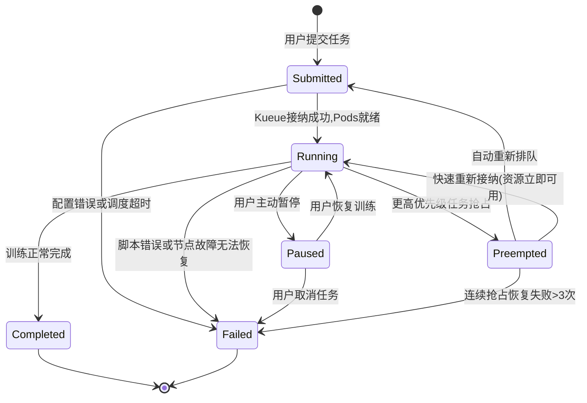

# Feature Specification: 企业级AI训练平台

**Feature Branch**: `001-ai-training-platform`
**Created**: 2025-12-23
**Status**: Draft
**Input**: User description: "基于需求分析文档构建企业级AI训练平台，支持模型训练、算力调度、数据管理、多租户和成本核算，目标是提升GPU资源利用率、降低训练成本并提高训练效率"

## Clarifications

### Session 2025-12-23
- Q: 当配额调整或高优先级任务导致低优先级任务被抢占时，如何保证数据不丢失？ → A: 在任务被抢占前自动创建检查点，确保数据不丢失
- Q: 训练任务资源限制策略应如何设置？ → A: 根据用户角色和项目设置默认限制，并允许管理员调整

### Session 2026-01-02
- Q: 分布式训练任务的自动检查点创建的最优时间间隔是多少? → A: 每10-15分钟一次检查点，平衡恢复时间和存储性能
- Q: 多租户资源调度的优先级级别应该如何定义? → A: 三级优先级(高/中/低)，平衡灵活性和复杂度
- Q: 用户身份认证机制应该采用什么方式? → A: 企业SSO(SAML/OIDC)集成 + 本地账号备用，实现统一身份管理
- Q: 成本核算的计费时间粒度应该是多少? → A: 按分钟计费，符合云计算标准实践，精确且开销可控
- Q: 预算预警的阈值应该如何设置? → A: 多级预警(80%/90%/100%)，提供渐进式预警机制

## Terminology Standards

本章节定义平台术语标准，确保跨文档、代码和 API 的命名一致性。

### 核心实体术语

| 中文术语 | 英文术语 | 数据模型 (Python) | 数据库表 (MySQL) | API 路径 | 使用场景 |
|---------|---------|-------------------|-----------------|----------|---------|
| 训练任务 | Training Job | `TrainingJob` | `training_jobs` | `/training-jobs` | 自然语言描述、用户界面 |
| 数据集 | Dataset | `Dataset` | `datasets` | `/datasets` | 自然语言描述、用户界面 |
| 检查点 | Checkpoint | `Checkpoint` | `checkpoints` | `/checkpoints` | 自然语言描述、用户界面 |
| 模型 | Model | `Model` | `models` | `/models` | 自然语言描述、用户界面 |
| 资源配额 | Resource Quota | `ResourceQuota` | `resource_quotas` | `/resource-quotas` | 自然语言描述、用户界面 |
| 用户 | User | `User` | `users` | `/users` | 自然语言描述、用户界面 |
| 集群 | Cluster | `HyperPodCluster` | `hyperpod_clusters` | `/clusters` | 自然语言描述、用户界面 |
| 审计日志 | Audit Log | `AuditLog` | `audit_logs` | `/audit-logs` | 自然语言描述、用户界面 |

### 命名规范

**1. 自然语言描述** (规范文档、用户界面、日志消息)
- **中文**: "训练任务"、"数据集"、"检查点"、"资源配额"
- **英文**: "Training Job"、"Dataset"、"Checkpoint"、"Resource Quota" (首字母大写，空格分隔)
- **使用场景**: spec.md 功能需求描述、tasks.md 任务说明、UI 界面文本、用户通知消息

**2. 代码实现** (Python 类、函数、变量)
- **类名**: `TrainingJob`、`Dataset`、`Checkpoint`、`ResourceQuota` (PascalCase)
- **变量/函数**: `training_job`、`dataset`、`checkpoint`、`resource_quota` (snake_case)
- **常量**: `TRAINING_JOB_STATUS`、`MAX_RETRY_COUNT`、`DEFAULT_PRIORITY` (UPPER_SNAKE_CASE)
- **模块名**: `training_job_service.py`、`dataset_repository.py` (小写 + 下划线)

**3. 数据库** (MySQL 表、列)
- **表名**: `training_jobs`、`datasets`、`checkpoints`、`resource_quotas` (小写复数 + 下划线)
- **列名**: `job_name`、`dataset_uri`、`checkpoint_path`、`quota_type` (小写 + 下划线)
- **索引名**: `idx_training_jobs_status`、`idx_users_email` (小写 + 下划线)

**4. API 接口** (RESTful URL 路径)
- **资源路径**: `/training-jobs`、`/datasets`、`/checkpoints`、`/resource-quotas` (小写复数 + 短横线)
- **操作路径**: `/training-jobs/{id}/pause`、`/datasets/{id}/versions` (小写 + 短横线)
- **查询参数**: `?job_id=123&status=running&owner_id=456` (小写 + 下划线)

**5. 前端代码** (TypeScript/React)
- **接口类型**: `TrainingJob`、`Dataset`、`Checkpoint` (PascalCase)
- **变量/函数**: `trainingJob`、`dataset`、`checkpoint` (camelCase)
- **组件名**: `TrainingJobList`、`DatasetUploader`、`CheckpointViewer` (PascalCase)
- **文件名**: `TrainingJobList.tsx`、`DatasetUploader.tsx` (PascalCase)

### 状态和枚举值

#### 训练任务状态 (TrainingJob Status)

| 状态 (中文) | 状态 (英文) | 代码常量 (Python) | API 值 | 数据库值 | 说明 |
|------------|------------|------------------|--------|---------|------|
| 已提交 | Submitted | `TrainingJobStatus.SUBMITTED` | `"Submitted"` | `"submitted"` | 等待资源分配和调度 |
| 运行中 | Running | `TrainingJobStatus.RUNNING` | `"Running"` | `"running"` | 训练正在执行 |
| 已暂停 | Paused | `TrainingJobStatus.PAUSED` | `"Paused"` | `"paused"` | 用户主动暂停 |
| 被抢占 | Preempted | `TrainingJobStatus.PREEMPTED` | `"Preempted"` | `"preempted"` | 被更高优先级任务抢占 |
| 已完成 | Completed | `TrainingJobStatus.COMPLETED` | `"Completed"` | `"completed"` | 训练成功完成 |
| 失败 | Failed | `TrainingJobStatus.FAILED` | `"Failed"` | `"failed"` | 训练失败 |

📖 **完整状态转换规则**: 参见 [Training Job State Model](#training-job-state-model-mandatory) 章节

#### 优先级和训练模式

| 概念 | 代码常量 (Python) | API 值 | 数据库值 | 显示文本 (中文) | 显示文本 (英文) |
|------|------------------|--------|---------|----------------|----------------|
| 优先级 - 高 | `Priority.HIGH` | `"High"` | `"high"` | "高" | "High" |
| 优先级 - 中 | `Priority.MEDIUM` | `"Medium"` | `"medium"` | "中" | "Medium" |
| 优先级 - 低 | `Priority.LOW` | `"Low"` | `"low"` | "低" | "Low" |
| 训练模式 - DDP | `TrainingMode.DDP` | `"DDP"` | `"ddp"` | "DDP" | "DDP" |
| 训练模式 - FSDP | `TrainingMode.FSDP` | `"FSDP"` | `"fsdp"` | "FSDP" | "FSDP" |
| 训练模式 - DeepSpeed | `TrainingMode.DEEPSPEED` | `"DeepSpeed"` | `"deepspeed"` | "DeepSpeed" | "DeepSpeed" |

**命名原则**:
- **代码常量**: 全大写 + 下划线 (UPPER_SNAKE_CASE)
- **API 值**: 首字母大写驼峰 (PascalCase)，保持可读性
- **数据库值**: 全小写 (lowercase)，节省存储和便于索引
- **显示文本**: 根据用户语言偏好选择中文或英文

### 模型管理术语

| 中文术语 | 英文术语 | 数据模型 (Python) | 数据库表/列 | API 路径/字段 | 说明 |
|---------|---------|-------------------|------------|--------------|------|
| 模型 | Model | `Model` | `models` | `/models` | 训练产出的模型制品 |
| 模型版本 | Model Version | `Model.version` | `models.version` | `/models/{id}/versions` | 模型的特定版本号 (语义化版本) |
| 模型注册表 | Model Registry | - | - | - | 通用概念，指模型版本管理系统 |
| SageMaker Model Registry | SageMaker Model Registry | `Model.registry_arn` | `models.registry_arn` | `registryArn` | AWS 托管的模型注册服务 |
| 模型制品 | Model Artifact | `Model.model_uri` | `models.model_uri` | `modelUri` | 模型文件的存储路径 (S3 URI) |
| 训练指标 | Training Metrics | `Model.metrics` | `models.metrics` (JSON) | `metrics` | 模型评估指标 (accuracy/loss) |
| 超参数 | Hyperparameters | `Model.hyperparameters` | `models.hyperparameters` (JSON) | `hyperparameters` | 训练超参数配置 |

**模型生命周期状态**:

| 状态 (中文) | 状态 (英文) | 代码常量 | API 值 | 数据库值 | 说明 |
|------------|------------|---------|--------|---------|------|
| 训练中 | Training | `ModelStatus.TRAINING` | `"Training"` | `"training"` | 模型正在训练 |
| 已注册 | Registered | `ModelStatus.REGISTERED` | `"Registered"` | `"registered"` | 模型已注册到 Model Registry |
| 已批准 | Approved | `ModelStatus.APPROVED` | `"Approved"` | `"approved"` | 模型已通过审核，可部署 |
| 已部署 | Deployed | `ModelStatus.DEPLOYED` | `"Deployed"` | `"deployed"` | 模型已部署到生产环境 |
| 已归档 | Archived | `ModelStatus.ARCHIVED` | `"Archived"` | `"archived"` | 模型已归档，不再使用 |
| 已拒绝 | Rejected | `ModelStatus.REJECTED` | `"Rejected"` | `"rejected"` | 模型未通过审核 |

**术语关系说明**:
- **训练任务 (Training Job)** → 产生 → **检查点 (Checkpoint)** → 提升为 → **模型 (Model)**
- **模型 (Model)** → 注册到 → **SageMaker Model Registry** → 生成 → **Model Registry ARN**
- **模型版本 (Model Version)** = 同一模型的不同训练批次 (例如 v1.0.0, v1.1.0, v2.0.0)
- **模型制品 (Model Artifact)** = 模型文件的物理存储 (通常为 S3 URI，例如 `s3://bucket/models/bert-v1.0.0/model.pt`)

**版本命名规范** (遵循语义化版本 Semantic Versioning):
- **格式**: `MAJOR.MINOR.PATCH` (例如 `1.0.0`, `1.2.3`, `2.0.0`)
- **MAJOR**: 不兼容的架构变更 (例如从 BERT 切换到 GPT)
- **MINOR**: 向后兼容的功能新增或性能提升 (例如增加训练数据集)
- **PATCH**: 向后兼容的 bug 修复或微调 (例如修复过拟合问题)
- **示例**: `bert-pretraining-v1.2.3` 表示 BERT 预训练模型的第 1 个主版本、第 2 次功能迭代、第 3 次 bug 修复

### 缩写规范

**✅ 允许使用的缩写** (业界标准):
- **云服务**: AWS, S3, EKS, FSx, EBS, IAM, VPC, ARN, URI, URL
- **机器学习**: GPU, CPU, ML, AI, DDP, FSDP, MLflow
- **通用技术**: API, SDK, REST, HTTP, TLS, JSON, YAML, SQL
- **训练框架**: PyTorch, TensorFlow (不缩写)

**❌ 禁止使用的缩写** (易混淆或非标准):
- TrainJob (应使用 TrainingJob)
- DS (Dataset 的缩写，易与 DeepSpeed 混淆)
- CP (Checkpoint 的缩写，不明确)
- RQ (ResourceQuota 的缩写，不明确)
- 任何自创缩写 (除非在术语词典中明确定义)

### 术语使用示例

**规范文档 (spec.md)**:
```markdown
- **FR-001**: 系统必须支持用户提交训练任务 (Training Job)
- 训练任务状态包括: Submitted, Running, Paused, Completed, Failed
```

**任务清单 (tasks.md)**:
```markdown
- [ ] [T025] POST /training-jobs 端点实现 - 创建训练任务
- [ ] [T027] GET /training-jobs/{id} 端点实现 - 查询训练任务详情
```

**Python 后端代码**:
```python
class TrainingJob(Base):
    __tablename__ = "training_jobs"

    id = Column(String, primary_key=True)
    job_name = Column(String, nullable=False)
    status = Column(Enum(TrainingJobStatus), default=TrainingJobStatus.SUBMITTED)

@router.post("/training-jobs")
async def create_training_job(training_job: TrainingJobCreate):
    pass
```

**TypeScript 前端代码**:
```typescript
interface TrainingJob {
  id: string;
  jobName: string;
  status: 'Running' | 'Paused' | 'Completed' | 'Failed';
}

const TrainingJobList: React.FC = () => {
  const { data: trainingJobs } = useTrainingJobs();
  return <Table items={trainingJobs} />;
};
```

**API 请求示例**:
```bash
# 创建训练任务
POST /api/v1/training-jobs
{
  "jobName": "bert-pretraining",
  "trainingMode": "FSDP",
  "priority": "High"
}

# 查询训练任务
GET /api/v1/training-jobs?status=running&owner_id=user123
```

## User Scenarios & Testing *(mandatory)*

### User Story 1 - 算法工程师提交和监控分布式训练任务 (Priority: P1)

算法工程师通过平台提交PyTorch分布式训练任务，系统自动调度合适的GPU资源并分配计算任务，工程师可以实时监控训练进度、指标和资源利用率。

**Why this priority**: 训练任务提交与监控是平台最核心的功能，直接影响日常工作效率和模型迭代速度。

**Independent Test**: 可以通过算法工程师创建并提交分布式训练任务，然后监控整个训练过程来验证。这个功能单独即可交付核心价值：实现模型训练。

**Acceptance Scenarios**:

1. **Given** 算法工程师已登录平台并拥有训练资源配额，**When** 提交包含分布式训练配置的PyTorch训练任务，**Then** 系统成功接收任务并将其分配到多个GPU节点上开始训练
2. **Given** 训练任务正在进行，**When** 算法工程师访问任务详情页，**Then** 实时显示训练状态、Loss曲线、GPU利用率和日志（指标刷新间隔≤30秒，日志流延迟<10秒）
3. **Given** 训练任务中断（如节点故障），**When** 系统检测到故障，**Then** 训练任务从最近检查点自动恢复继续训练
4. **Given** 算法工程师首次提交训练任务，**When** 系统检查资源限制，**Then** 应用基于用户角色和所属项目的默认资源限制

---

### User Story 2 - 数据工程师管理和版本控制训练数据集 (Priority: P1)

数据工程师上传、管理大规模训练数据集，创建数据版本，并将数据集关联到特定训练任务。

**Why this priority**: 高质量训练数据是AI模型成功的关键，数据管理能力对训练结果有直接影响。

**Independent Test**: 可以通过数据工程师上传数据集、创建版本并关联到训练任务来验证。单独提供数据管理价值：实现数据资产管理。

**Acceptance Scenarios**:

1. **Given** 数据工程师已登录平台，**When** 上传10GB大文件数据集，**Then** 系统支持断点续传并将数据保存到分布式存储
2. **Given** 现有数据集已存在，**When** 数据工程师创建新版本并标记，**Then** 系统保存新版本并记录版本差异
3. **Given** 算法工程师创建训练任务，**When** 选择特定版本的数据集，**Then** 系统正确关联数据集并在训练时提供高速访问（单任务数据读取吞吐量≥5GB/s，基于FSx for Lustre单客户端访问能力）

---

### User Story 3 - 平台管理员配置资源配额和监控集群 (Priority: P1)

平台管理员为不同部门/项目分配GPU资源配额，设置任务优先级策略，并监控整体集群运行状态。

**Why this priority**: 多租户资源管理是企业环境中确保资源公平使用和提高利用率的基础能力。

**Independent Test**: 可以通过管理员配置不同部门配额，并验证各部门能否按配额使用资源来测试。提供独立价值：实现资源治理。

**Acceptance Scenarios**:

1. **Given** 管理员已登录平台，**When** 为市场部分配50个GPU配额并设置较低优先级，**Then** 系统记录配置并限制该部门同时使用的GPU数量
2. **Given** 集群资源紧张，**When** 研发部提交高优先级任务，**Then** 系统能够自动抢占市场部低优先级任务的资源，并在抢占前自动为低优先级任务创建检查点
3. **Given** 管理员查看监控面板，**When** 检查集群状态，**Then** 可以看到资源使用率、任务队列和每个部门的使用情况
4. **Given** 管理员需要调整资源限制，**When** 为特定角色或项目修改默认资源限制，**Then** 新设置立即生效并应用于新提交的训练任务

---

### User Story 4 - 项目经理查看资源使用报表和成本分析 (Priority: P2)

项目经理访问平台生成的资源使用报表，分析项目GPU使用量和成本，并进行预算规划。

**Why this priority**: 成本管理和透明度对企业级平台至关重要，但依赖于前三个核心功能的实现。

**Independent Test**: 可以通过项目经理查看特定时间段内项目资源使用报表和成本数据来验证。提供独立价值：实现成本透明和管理。

**Acceptance Scenarios**:

1. **Given** 项目经理已登录平台，**When** 查看项目A的月度资源使用报表，**Then** 显示GPU使用时长、成本和历史趋势
2. **Given** 项目经理查看成本分析页面，**When** 比较多个项目的资源效率，**Then** 系统提供每个项目训练时长与模型性能提升的比率
3. **Given** 项目预算使用率到达预警阈值(80%、90%或100%)，**When** 新的训练任务提交或资源使用量更新，**Then** 系统根据阈值级别发送相应的预算预警通知给项目经理和提交者(80%为提前通知，90%为紧急警告，100%触发自动限制措施)

---

### User Story 5 - 算法工程师使用在线开发环境 (Priority: P2)

算法工程师通过平台提供的在线开发环境（JupyterLab/VS Code）进行模型开发和实验，直接连接到GPU资源。

**Why this priority**: 在线开发环境提供了便捷的实验能力，但作为辅助功能优先级低于核心训练和数据管理功能。

**资源限制说明**:
- **GPU 类型**: 支持 ml.g5.xlarge (1x NVIDIA A10G) 或 ml.g5.2xlarge (1x NVIDIA A10G) 实例
- **会话超时**: 空闲 1 小时自动关闭，最长运行时间 8 小时
- **存储配额**: 每用户 50GB EBS 存储（持久化环境），可访问共享 FSx for Lustre 数据集
- **并发限制**: 每用户同时运行 1 个开发环境实例
- **配额计算**: 开发环境资源消耗计入用户资源配额（参见 FR-008）

**Independent Test**: 可以通过算法工程师登录在线环境，创建笔记本并运行GPU加速代码来验证。提供独立价值：实现快速实验能力。

**Acceptance Scenarios**:

1. **Given** 算法工程师已登录平台，**When** 启动在线JupyterLab环境，**Then** 系统分配资源并在3分钟内提供可用的开发环境（基于SageMaker Spaces冷启动性能基准）
2. **Given** 工程师在JupyterLab中编写PyTorch代码，**When** 执行使用GPU的代码，**Then** 代码能直接访问已分配的GPU资源并加速执行
3. **Given** 工程师在开发环境中完成实验，**When** 点击"提交为训练任务"，**Then** 系统将代码转换为正式训练任务并提交到队列

---

### Edge Cases

- 当集群资源完全耗尽时，系统如何处理新提交的高优先级任务？
- **多个分布式训练任务竞争网络带宽时的处理**: 系统通过Kubernetes NetworkPolicy实现网络隔离,利用AWS EFA高性能网络拓扑(每节点400-3200 Gbps带宽)和HyperPod集群的网络优化,确保分布式训练任务间不会相互影响。关键机制包括:(1) Pod级网络QoS配置 (2) 训练任务调度时考虑网络拓扑亲和性 (3) 实时网络性能监控和告警
- **当用户提交的任务耗费资源但长期没有进展(训练卡住)时的处理**: 系统实现智能超时检测机制,监控训练任务的指标进度(如Loss值、Accuracy等)。如果任务在可配置的时间窗口内(默认30分钟)没有指标更新或指标无明显变化(变化率<0.1%),系统将:(1) 发送告警通知给任务提交者 (2) 标记任务为"疑似卡住"状态 (3) 提供手动终止或自动终止选项(需管理员配置) (4) 记录详细诊断日志用于问题排查
- 当单个节点网络中断但未完全故障时，分布式训练如何正确响应？
- 当配额调整导致正在运行的低优先级任务需要被抢占时，系统将在抢占前自动创建检查点，确保数据不丢失
- **检查点存储满载时的处理**: 当所有存储层 (NVMe/FSx/S3) 均满载时,系统保留最近1个检查点并暂停新检查点创建,发送紧急告警。详细分层应对策略 (告警阈值、迁移优先级、自动清理配置) 参见 FR-011 分层检查点存储策略
- **检查点损坏时的处理**: 系统在检查点创建时计算 SHA-256 校验和,恢复前验证完整性。若检测到损坏:(1) 自动尝试从上一个有效检查点恢复 (2) 记录损坏事件并发送告警 (3) 如果连续多个检查点损坏,暂停自动恢复并通知用户手动介入 (4) 提供检查点健康检查 API 供用户主动验证

## Training Job State Model *(mandatory)*

本系统采用双层状态模型,将底层Kueue调度状态映射到上层用户友好的训练任务状态。

### 用户层状态定义

训练任务(TrainingJob)在用户视角有以下6种状态:

1. **Submitted**: 任务已提交,正在等待资源分配和调度
   - 包含子阶段: 配额等待 → 接纳等待 → Pod启动
   - 用户操作: 可取消任务

2. **Running**: 训练正在执行
   - 训练进程正在运行,产生指标和日志
   - 系统定期创建检查点(默认10-15分钟间隔)
   - 用户操作: 可暂停、终止任务

3. **Paused**: 用户主动暂停训练
   - 保留Pod资源但停止训练进程
   - 检查点已保存
   - 用户操作: 可恢复或终止任务

4. **Preempted**: 被更高优先级任务抢占
   - 系统在抢占前自动创建检查点
   - 资源已释放,任务自动重新排队
   - 系统行为: 自动尝试从检查点恢复

5. **Completed**: 训练成功完成
   - 训练脚本正常退出
   - 模型已保存,指标已记录
   - 终态,不可转换

6. **Failed**: 训练失败,无法恢复
   - 配置错误、脚本错误、连续恢复失败
   - 终态,需用户修复后重新提交
   - 错误信息记录在任务详情中

### 状态转换图



### 底层Kueue状态映射

TrainingJob状态由底层Kueue Workload状态驱动:

#### Submitted状态的细分阶段

| Kueue Condition | 显示给用户的子状态 | 说明 |
|----------------|------------------|------|
| QuotaReserved=False | "等待配额" | 当前配额已满,排队等待 |
| QuotaReserved=True, Admitted=False | "等待接纳" | 配额已预留,等待调度器接纳 |
| Admitted=True, PodsReady=False | "启动Pod中" | Gang Scheduling进行中 |

用户在UI看到的是**Submitted**状态,但可通过详情查看具体阶段。

#### 抢占(Preemption)流程映射

**TrainingJob状态转换**: Running → Preempted

**触发条件**: Kueue Workload收到Evicted condition (reason: Preempted)

**系统行为**:
1. 检测到Evicted condition
2. 立即触发检查点创建(如果距上次检查点>5分钟)
3. 等待检查点完成(超时30秒则强制终止)
4. TrainingJob状态变更为Preempted
5. Kueue清理Pods,释放资源

**恢复流程1**: Preempted → Submitted → Running
- 系统自动将任务重新提交到队列
- Kueue Workload重新创建,进入QuotaReserved流程
- 从检查点恢复训练

**恢复流程2**: Preempted → Running (快速路径)
- Kueue快速重新接纳(资源立即可用)
- 从检查点恢复,继续训练

#### 故障场景映射

**节点故障**:
```
Kueue状态: PodsReady=False (部分Pod NotReady)
TrainingJob状态: 保持Running
系统行为:
  - 创建检查点(如果距上次创建>5分钟)
  - 等待Kubernetes重新调度失败的Pod
  - 在statusDetails中显示"正在从节点故障恢复中"
  - 如果超过5分钟未恢复 → TrainingJob变为Failed
```

**配置错误**:
```
Kueue状态: 无法创建Workload对象
TrainingJob状态: Submitted → Failed (立即转换)
失败原因: "配置验证失败: {具体错误}"
```

**训练脚本错误**:
```
Kueue状态: Finished=True (exit code != 0)
TrainingJob状态: Running → Failed
失败原因: "训练脚本异常退出: exit code {code}"
```

**连续抢占失败**:
```
场景: Preempted状态的任务连续3次恢复都被再次抢占
TrainingJob状态: Preempted → Failed

系统行为:
1. 检测逻辑:
   - TrainingJob 维护 preemption_count 计数器
   - 每次进入 Preempted 状态时 preemption_count += 1
   - 当 preemption_count >= 3 时触发失败转换

2. 状态转换执行:
   - 自动停止重新排队,防止无限循环
   - TrainingJob 状态变更为 Failed (终态)
   - 保留最后一个有效检查点 (statusDetails.lastCheckpoint)

3. 失败信息记录:
   - failureCategory: "PreemptionExhausted"
   - statusReason: "任务优先级过低,资源持续不足,已连续被抢占3次"
   - suggestion: "请提高任务优先级或在资源空闲时段重新提交"

4. 告警通知:
   - 发送邮件/消息通知给任务提交者 (owner_id)
   - 通知平台管理员 (admin 角色用户)
   - 告警内容包含: job_id, job_name, priority, preemption_count, lastCheckpoint

5. 监控指标记录 (Prometheus):
   - training_job_preemption_exhausted_total{priority="low|medium|high"}
   - training_job_preemption_count_histogram (连续抢占次数分布)

6. 审计日志:
   - 记录完整抢占历史: 每次抢占的时间、抢占原因 (preemptingJobId)
   - 记录失败决策依据: preemption_count, 最后3次抢占的时间间隔

用户恢复路径:
- 方案1: 提高任务优先级 (medium → high) 后重新提交
- 方案2: 在资源空闲时段 (如凌晨) 重新提交
- 方案3: 联系管理员临时增加配额或暂停其他低优先级任务
```

### 状态转换规则与触发条件

| 转换 | 触发条件 | 系统行为 |
|------|---------|---------|
| Submitted → Running | Kueue: Admitted=True AND PodsReady=True | 开始训练,启动指标监控 |
| Submitted → Failed | 配置验证失败 OR Gang Scheduling 连续失败(参见 FR-003 重试机制) OR 权限拒绝 | 记录失败原因,通知用户 |
| Running → Paused | 用户调用 POST /training-jobs/{id}/actions/pause | 保存检查点,停止训练进程,保留资源 |
| Running → Preempted | Kueue: Evicted=True (reason: Preempted) | 创建检查点,释放资源,自动重新排队 |
| Running → Completed | 训练脚本exit code=0 AND Kueue: Finished=True | 保存最终模型,记录指标,释放资源 |
| Running → Failed | 脚本exit code!=0 OR 节点故障无可用检查点 OR 连续恢复失败>3次 | 记录失败原因,保留最近检查点,释放资源 |
| Paused → Running | 用户调用 POST /training-jobs/{id}/actions/resume | 从检查点恢复,继续训练 |
| Paused → Failed | 用户调用 DELETE /training-jobs/{id} | 清理资源,标记为用户取消 |
| Preempted → Submitted | 系统自动重新提交(立即执行) | Workload重新创建,进入排队流程 |
| Preempted → Running | Kueue快速重新接纳(资源立即可用场景) | 跳过排队,直接从检查点恢复 |
| Preempted → Failed | 连续抢占恢复失败>3次 | 标记为优先级不足,停止自动恢复 |

### 与功能需求的对齐

#### FR-004 抢占式调度支持

> FR-004: 系统必须支持基于优先级的抢占式调度,采用三级优先级体系(高/中/低),高优先级任务可以抢占中低优先级任务的资源,中优先级任务可以抢占低优先级任务的资源,并在抢占前根据FR-010自动创建检查点保存训练状态

**实现映射**:
- **优先级体系**: 通过Kueue的PriorityClass实现(high/medium/low)
- **抢占机制**: Kueue的Preemption功能自动驱动
- **检查点保存**: 在检测到Evicted condition时立即触发
- **状态管理**: Preempted状态清晰表达被抢占的任务,自动重新排队恢复
- 📖 **详细状态转换流程**: 参见 [Training Job State Model](#training-job-state-model-mandatory) 章节的"抢占流程映射"

#### FR-010 自动检查点与断点续训

> FR-010: 系统必须实现自动检查点创建和断点续训功能,在以下场景自动触发检查点创建:(1)训练中断 (2)节点故障 (3)资源抢占 (4)用户手动触发 (5)定期自动创建(默认间隔10-15分钟)

**检查点触发场景映射**:
1. **训练中断** → 检测到Pods异常终止时触发
2. **节点故障** → 检测到PodsReady=False且持续>30秒时触发
3. **资源抢占** → 检测到Evicted condition (reason: Preempted)时立即触发
4. **用户手动触发** → API调用POST /training-jobs/{id}/checkpoints时触发
5. **定期创建** → Running状态下每10-15分钟定时触发

**断点续训实现**:
- Preempted → Submitted → Running: 从最新检查点自动恢复
- 节点故障恢复: 系统自动从检查点加载状态,继续训练
- 恢复时间目标: 5分钟内完成(符合SC-004)

📖 **详细状态转换和检查点管理**: 参见 [Training Job State Model](#training-job-state-model-mandatory) 章节

### API状态字段定义

TrainingJob API响应示例:

**Submitted状态**:
```json
{
  "id": "job-12345",
  "name": "bert-training",
  "status": "Submitted",
  "statusReason": "Waiting for quota",
  "statusDetails": {
    "submittedPhase": "WaitingForQuota",
    "kueueWorkloadStatus": {
      "quotaReserved": false,
      "admitted": false,
      "message": "insufficient quota for gpu in flavor default-flavor"
    },
    "queuePosition": 3,
    "estimatedStartTime": "2026-01-02T10:15:00Z"
  },
  "createdAt": "2026-01-02T10:00:00Z",
  "updatedAt": "2026-01-02T10:05:00Z"
}
```

**Running状态**:
```json
{
  "id": "job-12345",
  "name": "bert-training",
  "status": "Running",
  "statusReason": null,
  "statusDetails": {
    "kueueWorkloadStatus": {
      "quotaReserved": true,
      "admitted": true,
      "podsReady": true
    },
    "lastCheckpoint": {
      "id": "ckpt-456",
      "createdAt": "2026-01-02T10:25:00Z",
      "reason": "PeriodicSnapshot"
    },
    "nextCheckpointTime": "2026-01-02T10:35:00Z",
    "runningDuration": "00:25:15"
  },
  "startedAt": "2026-01-02T10:10:00Z",
  "updatedAt": "2026-01-02T10:25:15Z"
}
```

**Preempted状态**:
```json
{
  "id": "job-12345",
  "name": "bert-training",
  "status": "Preempted",
  "statusReason": "Preempted by higher priority job",
  "statusDetails": {
    "kueueWorkloadStatus": {
      "admitted": true,
      "evicted": true,
      "evictionReason": "Preempted to accommodate workload UID:5c023c28 due to prioritization"
    },
    "preemptionCount": 1,
    "lastCheckpoint": {
      "id": "ckpt-789",
      "createdAt": "2026-01-02T10:30:00Z",
      "reason": "PreemptionTriggered"
    },
    "estimatedRecoveryTime": "2026-01-02T10:35:00Z"
  },
  "createdAt": "2026-01-02T10:00:00Z",
  "preemptedAt": "2026-01-02T10:30:15Z",
  "updatedAt": "2026-01-02T10:30:15Z"
}
```

**Failed状态**:
```json
{
  "id": "job-12345",
  "name": "bert-training",
  "status": "Failed",
  "statusReason": "Training script error: exit code 1",
  "statusDetails": {
    "kueueWorkloadStatus": {
      "finished": true,
      "finishReason": "Failed"
    },
    "failureCategory": "ScriptError",
    "errorLog": "RuntimeError: CUDA out of memory. Tried to allocate 2.00 GiB...",
    "lastCheckpoint": {
      "id": "ckpt-789",
      "createdAt": "2026-01-02T10:25:00Z",
      "reason": "PeriodicSnapshot"
    },
    "retryable": true,
    "suggestion": "请减少batch_size或启用梯度累积"
  },
  "createdAt": "2026-01-02T10:00:00Z",
  "failedAt": "2026-01-02T10:32:45Z",
  "updatedAt": "2026-01-02T10:32:45Z"
}
```

### StatusDetails字段说明

**submittedPhase** (仅在status=Submitted时存在):
- `"WaitingForQuota"`: QuotaReserved=False,配额已满
- `"WaitingForAdmission"`: QuotaReserved=True, Admitted=False
- `"StartingPods"`: Admitted=True, PodsReady=False

**kueueWorkloadStatus** (所有状态都存在,方便高级用户调试):
- `quotaReserved`: boolean - 配额是否已预留
- `admitted`: boolean - 是否已被接纳到ClusterQueue
- `podsReady`: boolean - 所有Pod是否就绪
- `evicted`: boolean - 是否被驱逐
- `evictionReason`: string - 驱逐原因(如果evicted=true)
- `finished`: boolean - 是否已完成
- `finishReason`: string - 完成原因("Completed"或"Failed")
- `message`: string - Kueue状态详细消息

**preemptionCount**: integer - 任务被抢占的累计次数(用于判断是否超过阈值)

**failureCategory**: string - 失败分类,便于统计和诊断
- `"ConfigError"`: 配置验证失败
- `"ScriptError"`: 训练脚本错误
- `"NodeFailure"`: 节点故障无法恢复
- `"SchedulingTimeout"`: 调度超时
- `"PermissionDenied"`: 权限不足
- `"PreemptionExhausted"`: 连续抢占失败超过阈值

### 状态监控与指标

系统在Prometheus中记录以下状态转换指标:

```
# 状态分布
training_job_status{status="Submitted|Running|Paused|Preempted|Completed|Failed"}

# 状态转换计数
training_job_state_transitions_total{from_status="...", to_status="..."}

# 状态持续时间
training_job_status_duration_seconds{status="..."}

# 抢占相关指标
training_job_preemptions_total{priority="high|medium|low"}
training_job_preemption_recovery_duration_seconds
training_job_preemption_checkpoint_duration_seconds

# 失败原因分布
training_job_failures_total{failure_category="..."}
```

## Requirements *(mandatory)*

### Constitution Alignment

本规范所有功能需求的实现 MUST 遵循项目宪章 (constitution.md) 的核心原则，特别是：

- **Principle I.A (组件优先级)**: 所有技术组件选择必须遵循以下优先级：
  1. 首选: EKS 托管 Add-ons 和 HyperPod 原生能力
  2. 次选: AWS 托管服务
  3. 第三选: Kubernetes 生态兼容组件
  4. 避免: 自行实现 HyperPod 已提供的功能

- **Principle I.B (SDK-First)**: 尽可能使用 SDK 简化代码实现，避免重复造轮子。所有功能实现 MUST 按照以下决策流程选择实现方式：

  **1. 优先使用官方 SDK** (如果 SDK 支持该功能)
  - **HyperPod 功能** → 使用 `sagemaker-hyperpod` SDK（仅适用于 Cluster, Training, Inference, Space 四大功能模块）
  - **AWS 服务集成** (S3, SQS, SNS, CloudWatch, IAM 等) → 使用 boto3 或其他 AWS SDK
  - **Kubernetes 原生操作** → 使用 kubernetes-client

  **2. 次选成熟的开源库** (如果官方 SDK 不支持)
  - 社区广泛使用且维护活跃的库

  **3. 最后自行实现** (仅在以上方式均无法满足需求时)
  - MUST 提交例外申请并获得平台治理委员会批准

  **sagemaker-hyperpod SDK 适用范围**:

  | 功能模块 | 适用场景 | SDK 模块 |
  |---------|---------|---------|
  | **Cluster Management** | 集群连接、配置、监控、生命周期管理 | `sagemaker.hyperpod.cluster` |
  | **Training** | 训练任务提交、状态监控、生命周期管理 | `sagemaker.hyperpod.training` |
  | **Inference** | 模型端点创建、扩缩容、健康检查 | `sagemaker.hyperpod.inference` |
  | **Space** | JupyterLab/VS Code IDE 的创建和管理 | `sagemaker.hyperpod.space` |

  **实施要求**:
  - 开发 HyperPod 相关功能前 MUST 首先查阅 `sagemaker-hyperpod` SDK 文档确认是否支持
  - 开发 AWS 服务集成功能前 MUST 首先查阅 boto3 或相关 AWS SDK 文档
  - 代码审查 MUST 验证 SDK 选择的合理性（按功能域选择合适的 SDK）
  - 如需绕过 SDK 直接使用底层 API,MUST 在 PR 中说明理由
  - 平台 API 设计 SHOULD 与相关 SDK 保持一致的抽象层级和术语

- **Principle XI (UI/UX Consistency)**: 所有前端实现 MUST 使用 AWS Cloudscape Design System

- **Principle IX (测试策略与质量保证)**: 所有核心功能 MUST 具备全面的自动化测试覆盖，遵循测试金字塔策略。详细测试覆盖率要求参见 Success Criteria SC-011~SC-014

详细的组件选择和实现约束请参考各功能需求 (FR) 的具体说明。

### Functional Requirements

- **FR-001**: 系统必须支持用户提交单机和分布式PyTorch训练任务，明确支持以下训练模式（当前版本仅支持PyTorch框架）：
  - ✅ **支持**: 单机多卡(DataParallel) - 基础分布式能力，适合小规模训练
  - ✅ **支持**: DDP (DistributedDataParallel) - 推荐的多节点数据并行模式，性能优于DataParallel
  - ✅ **支持**: FSDP (Fully Sharded Data Parallel) - 适用于超大模型训练，支持参数分片
  - ✅ **支持**: DeepSpeed ZeRO (Stage 1/2/3) - 支持极大规模模型训练，提供内存优化和并行策略
  - ❌ **不支持**: Horovod、MegatronLM等其他框架（可在未来版本考虑）
  - 📋 **说明**: 每种训练模式对资源的要求和适用场景详见技术规格文档
  - 🔒 **技术约束**: (1)DataParallel 与 DDP 互斥，不能同时使用 (2)FSDP 与 DeepSpeed ZeRO 互斥，不能同时使用 (3)DDP 可以与 FSDP 组合使用（数据并行+模型分片） (4)DataParallel 仅适用于单机多卡场景，不支持与其他技术组合
  - 🎯 **选型建议**: 单机多卡推荐 DataParallel 或 DDP；多节点训练推荐 DDP；超大模型（>10B参数）推荐 FSDP 或 DeepSpeed ZeRO
  - 🔧 **实施约束**: MUST 使用 `sagemaker-hyperpod.training` 模块的训练任务提交 API 实现（该模块专门用于训练任务的提交、状态监控和生命周期管理）。
    具体方法参考: `sagemaker.hyperpod.training.submit_training_job()`
    如该模块不支持特定训练模式（DataParallel/DDP/FSDP/DeepSpeed ZeRO）或需要更细粒度控制,
    MAY 使用 boto3（SageMaker API）或 kubernetes-client（直接操作 PyTorchJob CRD）作为备选方案,
    但 MUST 提交例外申请并获得平台治理委员会批准,在代码中注释说明理由(遵循宪章 Principle I.B)
  - ⚠️ **错误处理**: 如果 HyperPod SDK 不支持用户请求的训练模式（例如 SDK 版本过低或集群配置不满足要求），SDK API 返回 `UnsupportedModeError` 及原因说明。训练任务提交失败，返回 HTTP 400 Bad Request，错误消息包含不支持原因和建议的替代训练模式（例如 "DeepSpeed ZeRO requires SDK version ≥2.0, current: 1.5. Suggested alternatives: FSDP, DDP"），记录到审计日志。系统**不**自动降级训练模式，由用户根据错误信息主动选择替代方案并重新提交
- **FR-002**: 系统必须提供训练任务队列管理，包括任务提交、调度、暂停、恢复和终止功能
  - 🔧 **实施约束**: MUST 使用 `sagemaker-hyperpod.training` 模块进行训练任务生命周期管理。
    具体操作包括：创建任务（submit_training_job）、监控状态（get_training_job_status）、暂停任务（pause_training_job）、恢复任务（resume_training_job）、终止任务（stop_training_job）。
    如该模块不支持特定生命周期操作,MAY 使用 boto3（SageMaker API）或 kubernetes-client（操作 PyTorchJob CRD）作为备选方案
- **FR-003**: 系统必须实现Gang Scheduling（组调度）机制，确保分布式训练任务的所有Pod在同一调度周期内被调度(时间窗口≤60秒)，所有Pod必须同时就绪后才能开始训练。具体实现机制采用HyperPod Training Operator的默认Gang Scheduling行为：
  - ⏱️ **调度窗口**: 所有Pod必须在60秒内达到就绪状态（基于HyperPod Training Operator默认配置，具体值以 AWS 官方文档为准）
  - 🔄 **失败处理**: 若超时或部分Pod调度失败，任务状态转为Failed，已创建的Pod自动清理
  - 🔁 **重试机制**: Gang Scheduling 失败后自动重试,策略如下 (基于 HyperPod Training Operator 默认配置,Phase 0 研究时验证):
    - 最大重试次数: 3 次
    - 重试间隔: 30 秒 (指数退避: 30s → 60s → 120s)
    - 连续失败判定: 连续 3 次重试均失败后,任务状态转为 Failed
    - 失败原因记录: statusDetails.failureCategory = "GangSchedulingExhausted"
    - 可配置性: 可通过训练任务配置覆盖默认重试参数
    - 📚 **参考文档**: [HyperPod Training Operator 重试配置](https://docs.aws.amazon.com/sagemaker/latest/dg/hyperpod-training-operator.html)
  - 📊 **状态转换**: Pending → Scheduling → Running（全部就绪）或 Failed（超时/失败）
  - 📚 **参考文档**: [AWS SageMaker HyperPod Training Operator Documentation](https://docs.aws.amazon.com/sagemaker/latest/dg/hyperpod-training-operator.html)
  - 🔧 **实施约束**: MUST 使用 HyperPod Training Operator 的原生 Gang Scheduling 能力。
    通过 `sagemaker-hyperpod.training` 模块提交训练任务时，Gang Scheduling 默认启用（无需额外配置）。
    如需自定义 Gang Scheduling 参数（如超时时间），MAY 在训练任务配置中指定相关参数，或使用 kubernetes-client 直接配置 PyTorchJob CRD,
    但 MUST 提交例外申请并获得平台治理委员会批准,在代码中注释说明理由(遵循宪章 Principle I.B)
- **FR-004**: 系统必须支持基于优先级的抢占式调度，采用三级优先级体系(高/中/低)，高优先级任务可以抢占中低优先级任务的资源，中优先级任务可以抢占低优先级任务的资源，并在抢占前根据FR-010自动创建检查点保存训练状态。
  - **抢占时序保证**:
    - (1) 抢占信号发出后，系统等待检查点创建完成后才释放资源
    - (2) 检查点创建超时（默认 5 分钟，参见 FR-010）后强制抢占，记录警告日志
    - (3) 强制抢占时保留上一个有效检查点，确保可恢复
  - **抢占恢复时序保证**:
    - 检测到抢占 → 检查点保存: 最长 5 分钟（超时则强制终止，标记 checkpointTimeout）
    - 检查点保存完成 → Pod 释放: 30 秒内
    - 重新排队 → 重新调度: 取决于资源可用性，遵循 Kueue 调度策略
    - 重新调度成功 → 恢复训练: 最长 2 分钟（加载检查点）
  - **恢复优先级**: 被抢占任务保持原优先级重新排队（高优先级被抢占任务优先恢复）
  - **恢复失败处理**: 若连续 3 次恢复失败，任务状态转为 Failed（参见状态模型连续抢占失败逻辑）
  - **优先级机制**: (1)**完全采用SageMaker HyperPod Task Governance (基于 Kueue) 原生优先级规则** (2)三级优先级映射到HyperPod的critical/high/medium级别 (3)同级任务排序依照HyperPod默认策略(基于提交时间和资源需求) (4)抢占规则遵循HyperPod原生行为,包括冷却期和最大抢占次数限制
  - 🔧 **实施约束**: MUST 使用 HyperPod Task Governance (Kueue) 的原生抢占机制。
    任务优先级配置：通过 `sagemaker-hyperpod.training` 模块提交训练任务时，在任务配置中指定优先级参数（high/medium/low）。
    抢占状态监控：底层 Kueue Workload 状态驱动抢占流程（详见 Training Job State Model 章节），通过 `get_training_job_status()` 方法获取抢占状态。
    如需细粒度配置（如自定义抢占策略、冷却期参数），MAY 使用 kubernetes-client 直接配置 Kueue ClusterQueue 和 PriorityClass 资源,
    但 MUST 提交例外申请并获得平台治理委员会批准,在代码中注释说明理由(遵循宪章 Principle I.B)
- **FR-005**: 系统必须提供大文件数据集的上传功能，支持断点续传和数据完整性校验
- **FR-006**: 系统必须实现数据集的版本控制功能，支持版本创建、标记和比较。版本比较功能包括：
  - **文件列表差异**: 新增文件、删除文件、修改文件（基于文件路径和 MD5 校验和）
  - **元数据对比**: 版本号、创建时间、创建者、描述信息、标签变化
  - **统计指标变化**: 文件数量、总大小、数据集类型分布（如图像/文本/音频比例）
  - **输出格式**: JSON 格式，包含 added_files、deleted_files、modified_files、metadata_diff、statistics_diff 字段
- **FR-007**: 系统必须提供**训练任务级**的实时监控功能，监控指标包括：(1)训练进度指标-Loss、Accuracy、Epoch/Step进度、学习率(Learning Rate) (2)**任务维度资源利用率**-GPU利用率(按训练任务聚合,反映单个任务的GPU资源占用)、GPU显存使用率(按训练任务聚合)、CPU利用率(按训练任务Pod聚合)、内存使用率(按训练任务Pod聚合) (3)性能指标-训练吞吐量(samples/sec)、迭代耗时 (4)可选高级指标-梯度范数(用户可选开启)。性能要求：
  - **训练业务指标刷新**（MLflow UI 可见性）: 用户记录后 30 秒内在 MLflow UI 可查询
  - **资源利用率指标刷新**（GPU/CPU/内存）: Prometheus 采集间隔 15 秒，前端 UI 轮询间隔 30 秒
  - **日志流延迟**: 从容器 stdout 到 CloudWatch Logs 可见 <10 秒
  - **监控数据查询响应**: API 查询 Prometheus/MLflow 的 P99 响应时间 <2 秒

  **职责边界说明**: FR-007 关注**训练任务维度**的监控(单个任务的资源占用、训练业务指标),FR-016 关注**集群维度**的监控(节点健康、节点级GPU利用率、集群整体负载)。两者在GPU利用率指标上的差异:FR-007反映"任务X使用了多少GPU资源",FR-016反映"节点Y的GPU被占用了多少"
  - 🔧 **实施约束**: 采用**双层监控架构**，明确职责分离

    **第一层：平台运维监控** (HyperPod Observability Add-on - Prometheus + Grafana)
    - **职责**: 集群级基础设施监控 (GPU/CPU/内存利用率、节点健康、训练任务队列状态、Kueue 调度延迟、存储和网络性能)
    - **数据采集**: 自动采集，用户无需集成 (通过 Node Exporter、cAdvisor、DCGM Exporter)
    - **刷新频率**: 15-30秒
    - **数据保留**: 15-30天
    - **查询接口**: Prometheus PromQL API 或 boto3 CloudWatch Metrics API
    - **可视化**: Amazon Managed Grafana 仪表盘
    - **适用场景**: 实时告警 (GPU 故障、节点 NotReady、存储满载)、运维监控、资源规划

    **第二层：实验和模型管理** (SageMaker Managed MLflow)
    - **职责**: 训练业务指标追踪 (loss/accuracy/perplexity)、超参数版本管理、模型版本控制、实验对比和可复现性
    - **数据采集**: 用户在训练脚本中主动集成 MLflow API
    - **记录频率**: 用户自定义 (推荐每个 epoch 或每 100 steps)
    - **数据保留**: 永久存储 (或根据策略归档)
    - **查询接口**: MLflow Tracking Server REST API + Web UI
    - **可视化**: MLflow UI 实验对比图表
    - **适用场景**: 超参数调优、模型版本对比、实验可复现性、模型血缘追踪

    **监控指标获取方式（按功能域选择）**：
    1. **训练任务状态监控**：使用 `sagemaker-hyperpod.training.get_training_job_status()` 获取任务状态和基本进度信息
    2. **资源利用率指标**（第一层）：直接查询 Prometheus API 或使用 boto3 调用 CloudWatch Metrics API
    3. **训练业务指标**（第二层）：从 MLflow Tracking Server 查询 (推荐) 或使用 Prometheus Pushgateway (备选，仅用于实时告警场景)
    4. **日志流**：使用 boto3 调用 CloudWatch Logs API 获取实时日志
    如需统一监控查询接口，MAY 使用 prometheus-client 或 mlflow-client 等开源 SDK

  - 📊 **训练业务指标集成步骤**（推荐方案：SageMaker Managed MLflow）：

    **集成步骤**:
    1. **安装依赖**：在训练容器镜像中添加 `mlflow` 包 (`pip install mlflow`)
    2. **配置 Tracking URI**：MLflow Tracking URI 通过环境变量 `MLFLOW_TRACKING_URI` 注入训练容器 (由平台自动配置)
    3. **设置实验**：训练脚本中设置实验名称 `mlflow.set_experiment('experiment-name')`
    4. **启动运行**：使用上下文管理器 `with mlflow.start_run():` 创建实验运行
    5. **记录超参数**：`mlflow.log_param('learning_rate', 1e-4)` 或 `mlflow.log_params({'batch_size': 32, 'optimizer': 'adam'})`
    6. **记录训练指标**：`mlflow.log_metric('loss', loss_value, step=epoch)` (推荐每个 epoch 记录)
    7. **记录模型制品**：`mlflow.pytorch.log_model(model, 'model')` 或 `mlflow.log_artifact('model.pt')`
    8. **注册模型**：`mlflow.register_model(f'runs:/{run_id}/model', 'ModelName')`

    **代码示例**:
    ```python
    import mlflow

    mlflow.set_tracking_uri(os.environ['MLFLOW_TRACKING_URI'])
    mlflow.set_experiment('bert-pretraining')

    with mlflow.start_run():
        mlflow.log_params({'learning_rate': 1e-4, 'batch_size': 32})

        for epoch in range(epochs):
            loss, accuracy = train_one_epoch()
            mlflow.log_metrics({'loss': loss, 'accuracy': accuracy}, step=epoch)

        mlflow.pytorch.log_model(model, 'model')
        mlflow.register_model(f'runs:/{mlflow.active_run().info.run_id}/model', 'BertModel')
    ```

    **环境变量配置**（由平台自动注入）：
    - `MLFLOW_TRACKING_URI`: MLflow Tracking Server 地址 (例如 `http://mlflow.platform.svc.cluster.local:5000`)
    - `TRAINING_JOB_ID`: 训练任务唯一标识 (用于实验标签)
    - `TRAINING_JOB_NAME`: 训练任务名称 (用于实验分组)

    **性能要求**：
    - 记录频率：推荐每个 epoch 或每 100 steps 记录一次 (避免过于频繁)
    - 批量记录：使用 `mlflow.log_metrics()` 批量记录多个指标 (而非多次调用 `log_metric()`)
    - 异步记录：MLflow 客户端内部已实现异步上报，用户无需额外处理

  - 🔄 **备选方案：Prometheus Pushgateway**（仅用于实时告警场景）：

    **适用场景**: 需要秒级实时告警的关键指标 (例如 loss 异常波动、梯度爆炸)

    **集成步骤**:
    1. **安装依赖**：`pip install prometheus-client`
    2. **配置 Pushgateway 地址**：通过环境变量 `PROMETHEUS_PUSHGATEWAY_URL` 获取 (例如 `http://pushgateway.monitoring.svc.cluster.local:9091`)
    3. **定义指标**：`from prometheus_client import CollectorRegistry, Gauge`
    4. **推送指标**：`push_to_gateway(pushgateway_url, job='training-job-123', registry=registry)`

    **限制**:
    - ⚠️ 仅支持数值型指标 (无法记录超参数、模型制品)
    - ⚠️ 无实验管理和版本对比能力
    - ⚠️ 数据保留期短 (15-30天)
    - ⚠️ 不推荐作为主要指标记录方案
- **FR-008**: 系统必须实现多租户隔离，支持按部门/项目分配资源配额
- **FR-009**: 系统必须提供资源使用统计和成本分析功能，支持按时间、项目和用户维度的数据查询，采用按分钟计费粒度进行成本核算，确保精确的资源使用成本追踪
- **FR-010**: 系统必须实现自动检查点创建和断点续训功能，支持 5 种检查点触发场景（详见 Training Job State Model 章节的"检查点触发场景映射"），确保训练状态可恢复且故障时平均损失训练进度不超过7.5分钟。系统依赖 HyperPod 的 Auto-Resume 机制和 Health Check Agent 实现节点故障自动检测和训练任务自动恢复
  - 🔧 **实施约束**: MUST 使用 HyperPod Elastic Agent 的检查点管理能力和 Auto-Resume 机制。
    实施方式（按功能域选择）：
    1. **训练任务检查点配置**：通过 `sagemaker-hyperpod.training` 模块提交训练任务时，在任务配置中指定检查点参数（检查点间隔、存储路径、恢复策略等）
    2. **集群级检查点策略**：使用 boto3 配置 HyperPod Cluster 的 Auto-Resume 参数和检查点存储配置
    3. **细粒度检查点控制**：如需自定义检查点触发逻辑或存储策略，MAY 使用 kubernetes-client 配置 PyTorchJob CRD 的检查点相关参数
    4. **手动触发检查点**：通过 `sagemaker-hyperpod.training.create_checkpoint()` 方法手动创建检查点
- **FR-011**: 系统必须实现分层检查点存储策略，采用三层存储架构(NVMe本地存储→FSx for Lustre→S3)，根据检查点创建时间自动分层，优化长时间训练的检查点写入性能和存储成本。实现细节:(1) 热检查点(创建时间最近的3个)保留在NVMe本地存储,提供最快访问 (2) 温检查点(创建时间第4-10个)自动迁移到FSx for Lustre (3) 冷检查点(创建序号>10个或创建时间超过72小时)自动归档到S3 (4) **迁移触发机制**:
  - **主触发**: 检查点创建完成后立即异步触发迁移评估,在后续 10 分钟内执行迁移（避免影响下次检查点创建）
  - **兜底机制**: 后台进程每 30 分钟扫描一次,执行失败或遗漏的迁移任务
  - **强制迁移**: 当存储使用率 >90% 时,忽略性能保护机制,强制执行迁移以释放空间

  (5) S3保留最近30天的检查点,超期自动清理 (6) **存储满载处理**:采用分层应对策略,当NVMe/FSx存储使用率>80%时触发告警并加速向下一层迁移,使用率>90%时触发紧急迁移(优先迁移最旧的检查点),若所有层均满载则保留最近1个检查点,暂停新检查点创建并发送紧急告警,管理员可配置自动清理策略(保留最近N个检查点) (7) **迁移失败回退**:迁移失败时保留原位置检查点,记录失败日志,下次迁移周期重试(最多3次),持续失败则触发告警 (8) **检查点完整性保护**:创建时计算SHA-256校验和,恢复前验证完整性,若损坏则自动尝试上一个有效检查点并告警
- **FR-012**: 系统必须提供JupyterLab/VS Code在线开发环境，支持GPU直连 (通过 Amazon SageMaker Spaces Add-on 实现)
  - 🔧 **实施约束**: MUST 使用 Amazon SageMaker Spaces Add-on 提供在线开发环境。
    Space 管理（Space 是 `sagemaker-hyperpod` SDK 的四大功能模块之一）：
    1. **Space 生命周期管理**：使用 `sagemaker-hyperpod.space` 模块进行 Space 的创建、配置和生命周期管理
    2. **具体方法**：`create_space()`、`delete_space()`、`get_space_details()`、`update_space_settings()` 等
    3. **备选方案**：如 `sagemaker-hyperpod.space` 模块不支持特定 Space 配置（如自定义镜像、资源配额），MAY 使用 boto3 调用 SageMaker Spaces API
- **FR-024**: 系统所有前端界面必须采用 AWS Cloudscape Design System 实现，确保UI组件、交互模式和视觉风格的一致性
  - 🔧 **实施约束**: MUST 遵循 Principle XI (UI/UX Consistency) 的完整要求,
    包括使用 AWS Cloudscape Design System 作为唯一 UI 组件库、遵循 AWS Console
    设计语言和交互模式、确保 WCAG 2.1 AA 无障碍标准等。详细要求参见
    constitution.md 中的 Principle XI 章节
- **FR-025**: 系统基础设施和配置管理必须采用 GitOps 工作流，所有基础设施配置（Kubernetes manifests、Terraform 配置）和应用配置通过 Git 仓库管理，配置变更通过 Pull Request 审核后自动部署。系统必须使用声明式配置方式，支持配置版本控制、变更审计和自动化部署
  - 🔧 **实施约束**: MUST 使用 GitOps 工具（如 ArgoCD 或 Flux）实现配置自动同步和部署，所有配置文件必须存储在 Git 仓库中并通过 CI/CD 流程验证
- **FR-013**: 系统必须支持模型版本管理，包括模型存储、标记和比较功能
  - 🔧 **实施约束**: MUST 使用 SageMaker Model Registry 进行模型版本控制和治理。
    **注意**：Model Registry 不在 `sagemaker-hyperpod` SDK 的适用范围内（该 SDK 仅适用于 Cluster/Training/Inference/Space 四大功能模块）。
    实施方式（按功能域选择 AWS 服务集成 SDK）：
    1. **首选**：使用 boto3 调用 SageMaker Model Registry API（`register_model`、`create_model_package`、`update_model_package` 等）
    2. **次选**：如需更高层抽象，MAY 使用 `sagemaker` Python SDK（`ModelPackage` 类）
    3. **备选**：如有特殊集成需求，MAY 使用其他成熟的开源 SDK
- **FR-014**: 系统必须提供全链路日志收集和查询功能。日志来源：(1)容器stdout/stderr (2)训练框架日志(PyTorch等) (3)系统事件日志(Pod生命周期、调度事件)。日志格式：JSON结构化格式,包含timestamp、level、job_id、pod_name、message字段。性能要求：日志保留期30天、查询响应时间P99<3秒、支持全文检索。敏感信息处理：由用户在训练代码中自行处理,系统不做自动脱敏
- **FR-015**: 系统必须实现完整的用户认证和权限控制，支持企业SSO(SAML/OIDC)集成与企业身份系统对接，同时提供本地账号作为备用认证方式，确保在SSO服务不可用时系统仍可正常运行。**SSO故障转移机制**:(1)SSO请求超时阈值为5秒 (2)检测到SSO请求超时或连续失败3次时,自动降级到本地账号登录模式 (3)降级期间,登录页面显示"SSO服务暂时不可用,请使用本地账号登录"提示 (4)后台每分钟执行SSO健康检查,恢复后自动切回SSO优先模式 (5)故障转移事件记录到审计日志。访问控制必须实现基于角色的访问控制（RBAC），遵循最小权限原则，确保用户仅能访问其职责范围内的资源和操作
- **FR-016**: 系统必须提供**集群级**资源使用监控仪表盘和告警功能，监控指标包括：(1)节点健康状态 (2)**节点维度资源利用率**-节点级GPU利用率(反映单个节点的GPU被占用情况)、节点级内存利用率、节点级网络利用率 (3)集群整体负载-总GPU使用率、任务队列长度、Kueue调度延迟。节点健康监控依赖 HyperPod 的 Health Check Agent 进行自动健康检查和故障检测，支持 Deep Health Check 进行深度硬件和软件层面的健康验证。**职责边界说明**: FR-016 关注**集群和节点维度**的监控(基础设施健康、资源容量),FR-007 关注**训练任务维度**的监控(单个任务的资源消耗和业务指标)。两者在GPU利用率指标上的差异:FR-016反映"节点Y的GPU被占用了多少"(节点视角),FR-007反映"任务X使用了多少GPU资源"(任务视角)
  - 🔧 **实施约束**: MUST 使用 HyperPod Observability Add-on (Prometheus + Grafana) 和 Amazon Managed Grafana 进行集群监控和可视化。
    监控数据获取方式（按功能域选择）：
    1. **集群状态和节点健康**：使用 `sagemaker-hyperpod.cluster` 模块查询集群整体状态和节点健康状态（由 Health Check Agent 提供）
    2. **资源利用率指标**（GPU/CPU/内存/网络）：使用 boto3 调用 CloudWatch Metrics API 或 EKS API 获取集群级资源指标
    3. **自定义监控查询**：直接查询 Prometheus API 或使用 prometheus-client 等开源 SDK
    4. **可视化仪表盘**：使用 Amazon Managed Grafana 或通过 grafana-api 自定义仪表盘
- **FR-017**: 系统必须实现100%关键操作的审计日志记录，审计日志保留期≥90天，记录内容包括用户身份、操作时间、操作类型、操作对象和操作结果。
  - **审计职责分层**:
    - **AWS 原生审计** (AWS CloudTrail 自动记录): IAM 身份认证、S3 对象访问、EKS API 调用、SageMaker HyperPod API 调用
    - **应用层审计** (本系统记录到 CloudWatch Logs): 训练任务生命周期操作、数据集管理、资源配额变更、检查点操作、模型版本管理
  - **应用层关键操作范围**:
    - 训练任务: 创建、更新、删除、暂停、恢复、终止
    - 数据集: 创建、删除、版本创建
    - 用户: 创建、更新角色、删除
    - 资源配额: 创建、更新、删除
    - 检查点: 创建、删除、恢复
    - 模型: 注册、批准、部署、归档
  - **审计日志字段结构** (JSON 格式):
    ```json
    {
      "timestamp": "ISO 8601 时间戳",
      "user_id": "用户ID",
      "user_email": "用户邮箱",
      "user_ip": "客户端IP地址",
      "operation_type": "CREATE|UPDATE|DELETE|PAUSE|RESUME|TERMINATE",
      "resource_type": "TrainingJob|Dataset|User|ResourceQuota|Checkpoint|Model",
      "resource_id": "资源唯一标识符",
      "resource_arn": "AWS ARN (如适用)",
      "operation_result": "SUCCESS|FAILURE",
      "error_message": "失败时的错误信息",
      "request_id": "API 请求唯一标识符"
    }
    ```
  - **存储实现**: 应用层审计日志写入 CloudWatch Logs（日志组: `/ai-platform/audit-logs`），保留期配置为 90 天，AWS 原生审计由 CloudTrail 自动管理
  - **查询能力**: 支持按 user_id、resource_type、operation_type、time_range 过滤查询（通过 CloudWatch Logs Insights）
- **FR-018**: 系统必须支持数据加密，包括静态数据加密（使用 S3 SSE-KMS）和传输中加密（所有网络通信使用 TLS 1.2 或更高版本）
- **FR-019**: 系统必须根据用户角色和项目设置训练任务的默认资源限制，并允许管理员进行调整
- **FR-020**: 系统必须实现分层存储容量监控和告警机制：
  - **监控粒度**: 分别监控 NVMe、FSx for Lustre 二层存储使用率
  - **告警阈值**:
    - 警告级别 (80%): 发送邮件通知管理员，加速检查点迁移到下一层
    - 严重级别 (90%): 触发紧急迁移（参见 FR-011），暂停新检查点创建（保留最近 1 个）
    - 满载级别 (95%): 暂停新训练任务提交，发送紧急告警，要求管理员介入
  - **自动扩容**: S3 自动扩容无需配置，FSx 支持自动扩容（需管理员在基础设施配置中启用），NVMe 容量固定不支持自动扩容
  - **运行中任务保护**: 存储告警不影响已运行任务，但会限制新检查点创建频率（从 10-15 分钟延长到 30 分钟）
- **FR-021**: 系统必须实现网络带宽管理和QoS策略，采用HyperPod默认网络隔离机制(EFA网络优化、Pod级网络命名空间隔离)，确保分布式训练任务间的网络隔离和性能保证。性能目标：网络延迟P99<10ms、带宽利用率>80%。可选扩展：支持用户通过任务配置自定义NetworkPolicy规则。隔离保证：完全依赖HyperPod网络隔离能力，隔离程度以HyperPod官方文档为准，任务间实际性能影响由底层基础设施决定
  - 🔧 **实施约束**: 网络隔离和QoS配置 MUST 优先依赖 HyperPod EKS 集群的原生 NetworkPolicy 和 EFA 网络拓扑优化，避免自行实现网络管理组件。如需扩展，MAY 通过 Kubernetes NetworkPolicy 进行自定义配置
- **FR-022**: 系统必须实现训练任务超时和停滞检测机制。检测策略：
  - **主指标选择逻辑**:
    1. 优先使用用户在训练配置中指定的 `stall_detection_metric` 参数
    2. 若未指定，按优先级自动选择第一个可用指标: Loss → Accuracy → Perplexity → 首个用户记录的指标
    3. 若 30 分钟内无任何指标记录，不触发停滞检测
  - **变化率计算**: 相对变化率 = |当前值 - 30分钟前值| / |30分钟前值|
    - 特殊处理: 若 30 分钟前值为 0，使用绝对变化 |当前值 - 30分钟前值| < 0.001
    - 停滞判定标准: 相对变化率 < 0.1% (可配置时间窗口默认 30 分钟)
  - **其他指标处理**: 其他指标异常仅记录日志供参考，不触发告警
  - **震荡型训练处理**: 用户可在训练配置中设置 `disable_stall_detection: true` 禁用检测（适用于 GAN/RL 等场景）

  触发后发送告警并提供自动/手动终止选项

### Key Entities

- **训练任务（TrainingJob）**: 表示一个AI模型训练作业，包含训练配置、资源需求、关联数据集、训练状态和指标数据
- **数据集（Dataset）**: 表示训练数据集合，包含元数据、版本信息、存储位置和使用权限
- **资源配额（ResourceQuota）**: 表示分配给特定团队/项目的计算资源限制，包含GPU数量、CPU核心、内存等资源指标和优先级信息(高/中/低三级优先级，映射到 Kueue 的 PriorityClass: high/medium/low)
- **用户（User）**: 系统用户，包含身份信息、所属团队/项目、权限等级和资源使用记录
- **检查点（Checkpoint）**: 训练过程中保存的模型状态，包含存储位置、创建时间和相关训练指标
- **模型（Model）**: 训练产出的模型，包含版本信息、性能指标、部署状态和生命周期信息。模型生命周期状态包括：
  - **Training**: 训练中，模型尚未完成
  - **Registered**: 已注册到 SageMaker Model Registry，待审批
  - **Approved**: 已批准，可用于部署
  - **Deployed**: 已部署到推理端点
  - **Archived**: 已归档，不再使用
  - **状态转换规则**: Training → Registered（训练完成自动注册）→ Approved（人工批准）→ Deployed（部署到端点）→ Archived（废弃时归档），支持从 Approved/Deployed 直接归档
- **资源限制配置（ResourceLimitConfig）**: 基于用户角色和项目的默认资源限制设置，包含最大GPU数、内存限制、存储空间等

## Success Criteria *(mandatory)*

### Measurable Outcomes

- **SC-001**: GPU集群整体利用率≥70%
- **SC-002**: 模型训练周期比现有流程缩短至少50%（在同等规模任务下）
- **SC-003**: 平台可用性达到99%（年度）
- **SC-004**: 训练任务在节点故障后能在5分钟内自动恢复
- **SC-005**: 新用户能在2小时内完成首次模型训练流程
- **SC-006**: 算力成本降低至少30%（通过提高资源利用率和优化调度）
- **SC-007**: 平台支持≥1000名注册用户，API响应时间P99 < 3秒
- **SC-008**: 数据集上传支持10GB+大文件，上传成功率达到99%
- **SC-009**: 断点续训成功率达到99%以上
- **SC-010**: 100%关键操作可追溯审计
- **SC-011**: 单元测试覆盖率达到80%以上，关键业务逻辑（训练任务调度、检查点管理、资源配额控制）覆盖率≥90%
- **SC-012**: 集成测试覆盖率达到70%以上，所有关键API端点（训练任务提交、监控数据查询、资源配额管理）实现100%覆盖
- **SC-013**: E2E测试覆盖所有5个核心User Stories的关键场景，自动化测试通过率≥95%
- **SC-014**: 代码质量达到以下标准：(1)Python代码遵循PEP 8规范、TypeScript/JavaScript代码遵循ESLint规范 (2)所有代码变更通过至少一人代码审查 (3)静态分析工具（pylint、eslint、mypy）检查通过率100% (4)函数圈复杂度≤10
- **SC-015**: 系统安全达到以下标准：(1)所有静态数据使用 S3 SSE-KMS 加密、所有传输使用 TLS 1.2+ (2)实现基于角色的访问控制（RBAC）和最小权限原则 (3)审计日志保留期≥90天 (4)通过定期安全扫描，无高危漏洞
- **SC-016**: 基础设施和配置管理达到以下标准：(1)100%配置文件纳入 Git 版本控制 (2)所有配置变更通过 Pull Request 审核 (3)配置自动同步和部署成功率≥99% (4)配置变更审计追踪完整